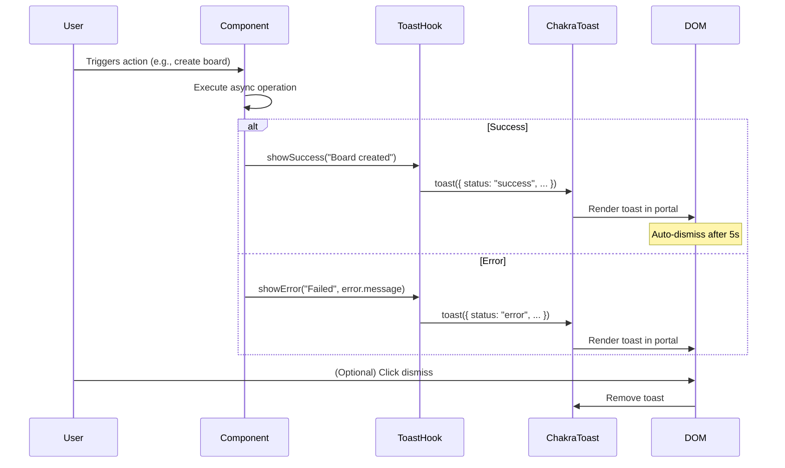
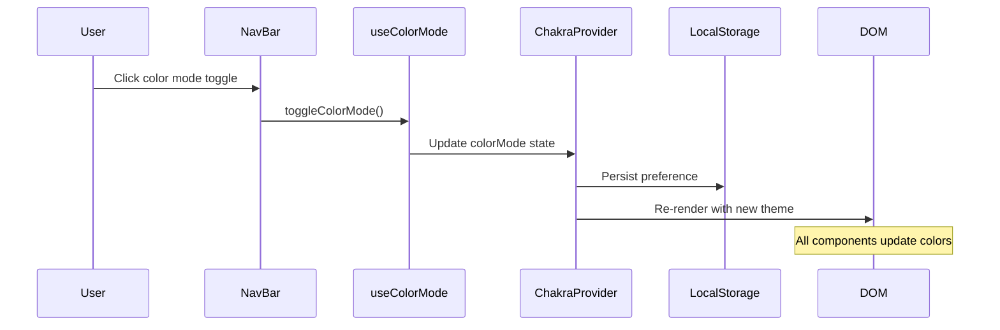
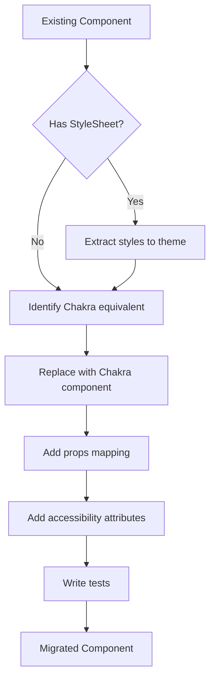

# Technical Design Document: Chakra UI Migration

## Overview

This document outlines the technical design for migrating the Personal Kanban Board frontend from React Native StyleSheet-based styling to Chakra UI. The migration will transform the application into a modern, accessible, and visually consistent web application while maintaining all existing functionality.

### Goals

1. **Consistent Design System**: Replace ad-hoc StyleSheet definitions with Chakra UI's component-based design system
2. **Improved Accessibility**: Leverage Chakra UI's built-in ARIA support and keyboard navigation
3. **Dark/Light Mode Support**: Implement seamless color mode switching with persistence
4. **Enhanced UX**: Add toast notifications, tooltips, and polished interactions
5. **Responsive Design**: Utilize Chakra's responsive utilities for mobile-first design

### Migration Strategy

The migration follows a **bottom-up approach**:
1. Set up Chakra UI provider and theme configuration
2. Create reusable base components (buttons, inputs, cards)
3. Migrate screens progressively, starting with authentication flows
4. Add cross-cutting features (toasts, tooltips) last

---

## Architecture

### High-Level Architecture

```
┌─────────────────────────────────────────────────────────────────┐
│                        App.tsx (Root)                           │
├─────────────────────────────────────────────────────────────────┤
│  ┌─────────────────────────────────────────────────────────┐   │
│  │              ChakraProvider + ColorModeScript            │   │
│  │  ┌─────────────────────────────────────────────────┐    │   │
│  │  │                 Custom Theme                     │    │   │
│  │  │  • Brand colors (indigo #6366f1)                │    │   │
│  │  │  • Component style overrides                    │    │   │
│  │  │  • Responsive breakpoints                       │    │   │
│  │  └─────────────────────────────────────────────────┘    │   │
│  └─────────────────────────────────────────────────────────┘   │
│  ┌─────────────────────────────────────────────────────────┐   │
│  │                    Redux Provider                        │   │
│  │  ┌─────────────────────────────────────────────────┐    │   │
│  │  │              ToastProvider (Context)             │    │   │
│  │  │  ┌─────────────────────────────────────────┐    │    │   │
│  │  │  │           RootNavigator                  │    │    │   │
│  │  │  │  • Auth Screens (Login, Register)       │    │    │   │
│  │  │  │  • Main Screens (BoardList, Board)      │    │    │   │
│  │  │  │  • Detail Screens (Task, Epic)          │    │    │   │
│  │  │  └─────────────────────────────────────────┘    │    │   │
│  │  └─────────────────────────────────────────────────┘    │   │
│  └─────────────────────────────────────────────────────────┘   │
└─────────────────────────────────────────────────────────────────┘
```

### Provider Hierarchy

The application will use the following provider hierarchy:

```typescript
<ChakraProvider theme={customTheme}>
  <ColorModeScript initialColorMode={theme.config.initialColorMode} />
  <Provider store={store}>
    <PersistGate loading={<LoadingScreen />} persistor={persistor}>
      <ToastProvider>
        <RootNavigator />
      </ToastProvider>
    </PersistGate>
  </Provider>
</ChakraProvider>
```

### Key Architectural Decisions

| Decision | Rationale |
|----------|-----------|
| ChakraProvider at root | Ensures all components have access to theme and color mode |
| Custom ToastProvider | Centralizes toast logic and provides consistent API across app |
| Preserve Redux for state | Chakra handles UI state; Redux handles application state |
| Web-first approach | Chakra UI is optimized for web; React Native Web provides compatibility |

---

## Components and Interfaces

### Component Hierarchy

```
src/
├── components/
│   ├── chakra/                    # Chakra-specific components
│   │   ├── index.ts               # Barrel export
│   │   ├── AppCard.tsx            # Styled Card wrapper
│   │   ├── AppButton.tsx          # Button with variants
│   │   ├── AppInput.tsx           # Form input with validation
│   │   ├── AppModal.tsx           # Modal wrapper
│   │   ├── AppTooltip.tsx         # Tooltip wrapper
│   │   ├── NavBar.tsx             # Navigation bar
│   │   ├── LoadingState.tsx       # Skeleton/spinner states
│   │   └── EmptyState.tsx         # Empty state display
│   ├── TaskCard.tsx               # Migrated task card
│   ├── FilterBar.tsx              # Migrated filter bar
│   └── ...                        # Other migrated components
├── hooks/
│   ├── useToast.ts                # Toast notification hook
│   └── useColorMode.ts            # Color mode utilities
├── theme/
│   ├── index.ts                   # Theme configuration
│   ├── colors.ts                  # Color definitions
│   ├── components/                # Component style overrides
│   │   ├── button.ts
│   │   ├── card.ts
│   │   ├── input.ts
│   │   └── modal.ts
│   └── foundations/               # Design tokens
│       ├── typography.ts
│       ├── spacing.ts
│       └── shadows.ts
└── screens/
    ├── LoginScreen.tsx            # Migrated screens
    ├── RegisterScreen.tsx
    ├── BoardListScreen.tsx
    ├── BoardScreen.tsx
    ├── TaskDetailScreen.tsx
    ├── EpicListScreen.tsx
    └── EpicDetailScreen.tsx
```

### Core Component Interfaces

#### AppCard Component

```typescript
interface AppCardProps extends CardProps {
  /** Left border color for visual categorization */
  accentColor?: string;
  /** Enable hover elevation effect */
  isHoverable?: boolean;
  /** Card variant: elevated, outline, filled */
  variant?: 'elevated' | 'outline' | 'filled';
  /** Click handler */
  onClick?: () => void;
  /** Children content */
  children: React.ReactNode;
}
```

#### AppButton Component

```typescript
interface AppButtonProps extends ButtonProps {
  /** Button intent: primary, secondary, danger, ghost */
  intent?: 'primary' | 'secondary' | 'danger' | 'ghost';
  /** Left icon component */
  leftIcon?: React.ReactElement;
  /** Right icon component */
  rightIcon?: React.ReactElement;
  /** Loading state */
  isLoading?: boolean;
  /** Tooltip text for icon-only buttons */
  tooltip?: string;
}
```

#### AppInput Component

```typescript
interface AppInputProps extends InputProps {
  /** Form label */
  label?: string;
  /** Error message */
  error?: string;
  /** Helper text */
  helperText?: string;
  /** Whether field is required */
  isRequired?: boolean;
  /** Left element (icon or addon) */
  leftElement?: React.ReactNode;
  /** Right element (icon or addon) */
  rightElement?: React.ReactNode;
}
```

#### AppModal Component

```typescript
interface AppModalProps extends ModalProps {
  /** Modal title */
  title: string;
  /** Primary action button text */
  primaryActionText?: string;
  /** Primary action handler */
  onPrimaryAction?: () => void;
  /** Secondary action button text */
  secondaryActionText?: string;
  /** Secondary action handler */
  onSecondaryAction?: () => void;
  /** Loading state for primary action */
  isLoading?: boolean;
  /** Modal size */
  size?: 'sm' | 'md' | 'lg' | 'xl' | 'full';
  /** Children content */
  children: React.ReactNode;
}
```

#### NavBar Component

```typescript
interface NavBarProps {
  /** Current user for avatar display */
  user: User | null;
  /** Navigation handler */
  onNavigate: (route: string) => void;
  /** Logout handler */
  onLogout: () => void;
}
```

#### Toast Hook Interface

```typescript
interface ToastOptions {
  title: string;
  description?: string;
  status: 'success' | 'error' | 'warning' | 'info';
  duration?: number;
  isClosable?: boolean;
  action?: {
    label: string;
    onClick: () => void;
  };
}

interface UseToastReturn {
  showToast: (options: ToastOptions) => void;
  showSuccess: (title: string, description?: string) => void;
  showError: (title: string, description?: string) => void;
  showWarning: (title: string, description?: string) => void;
  showInfo: (title: string, description?: string) => void;
}
```

### Screen Component Structure

Each screen follows a consistent structure:

```typescript
// Example: BoardListScreen structure
function BoardListScreen(): React.JSX.Element {
  // 1. Hooks
  const { colorMode } = useColorMode();
  const toast = useAppToast();
  const dispatch = useAppDispatch();
  
  // 2. Selectors
  const boards = useAppSelector(selectAllBoards);
  const isLoading = useAppSelector(selectBoardsLoading);
  
  // 3. Local state
  const [isCreateModalOpen, setIsCreateModalOpen] = useState(false);
  
  // 4. Effects
  useEffect(() => { /* fetch data */ }, []);
  
  // 5. Handlers
  const handleCreateBoard = async (data: CreateBoardData) => {
    try {
      await dispatch(createBoard(data)).unwrap();
      toast.showSuccess('Board created', 'Your new board is ready');
      setIsCreateModalOpen(false);
    } catch (error) {
      toast.showError('Failed to create board', error.message);
    }
  };
  
  // 6. Render
  return (
    <Box minH="100vh" bg={useColorModeValue('gray.50', 'gray.900')}>
      <NavBar user={user} onNavigate={navigate} onLogout={handleLogout} />
      <Container maxW="container.xl" py={8}>
        {/* Content */}
      </Container>
    </Box>
  );
}
```

---

## Data Models

### Theme Configuration Model

```typescript
interface CustomTheme extends Theme {
  colors: {
    brand: {
      50: string;   // Lightest
      100: string;
      200: string;
      300: string;
      400: string;
      500: string;  // Primary (indigo #6366f1)
      600: string;
      700: string;
      800: string;
      900: string;  // Darkest
    };
    priority: {
      critical: string;
      high: string;
      medium: string;
      low: string;
    };
  };
  config: {
    initialColorMode: 'light' | 'dark' | 'system';
    useSystemColorMode: boolean;
  };
  components: {
    Button: ComponentStyleConfig;
    Card: ComponentStyleConfig;
    Input: ComponentStyleConfig;
    Modal: ComponentStyleConfig;
    // ... other components
  };
}
```

### Toast State Model

```typescript
interface ToastState {
  id: string;
  title: string;
  description?: string;
  status: 'success' | 'error' | 'warning' | 'info';
  duration: number;
  isClosable: boolean;
  position: ToastPosition;
  action?: {
    label: string;
    onClick: () => void;
  };
}

type ToastPosition = 
  | 'top' 
  | 'top-right' 
  | 'top-left' 
  | 'bottom' 
  | 'bottom-right' 
  | 'bottom-left';
```

### Color Mode Persistence Model

```typescript
interface ColorModeState {
  colorMode: 'light' | 'dark';
  persistedAt: string;
}

// Storage key
const COLOR_MODE_STORAGE_KEY = '@kanban_color_mode';
```

---

## Error Handling

### Toast-Based Error Display

All user-facing errors will be displayed via the toast system:

```typescript
// Error handling pattern
const handleAsyncAction = async () => {
  try {
    await dispatch(someAction()).unwrap();
    toast.showSuccess('Action completed');
  } catch (error) {
    if (error instanceof ApiError) {
      toast.showError(error.message, error.details?.join(', '));
    } else {
      toast.showError('An unexpected error occurred');
    }
  }
};
```

### Form Validation Errors

Form validation uses Chakra's FormControl with FormErrorMessage:

```typescript
<FormControl isInvalid={!!errors.email}>
  <FormLabel>Email</FormLabel>
  <Input
    type="email"
    value={email}
    onChange={(e) => setEmail(e.target.value)}
  />
  <FormErrorMessage>
    <FormErrorIcon />
    {errors.email}
  </FormErrorMessage>
</FormControl>
```

### Error Boundaries

Wrap major sections with error boundaries:

```typescript
<ErrorBoundary
  fallback={
    <Alert status="error">
      <AlertIcon />
      <AlertTitle>Something went wrong</AlertTitle>
      <AlertDescription>
        Please refresh the page or try again later.
      </AlertDescription>
    </Alert>
  }
>
  <BoardScreen />
</ErrorBoundary>
```

### Error State Components

```typescript
interface ErrorStateProps {
  title: string;
  description?: string;
  onRetry?: () => void;
}

function ErrorState({ title, description, onRetry }: ErrorStateProps) {
  return (
    <Alert
      status="error"
      variant="subtle"
      flexDirection="column"
      alignItems="center"
      justifyContent="center"
      textAlign="center"
      height="200px"
      borderRadius="lg"
    >
      <AlertIcon boxSize="40px" mr={0} />
      <AlertTitle mt={4} mb={1} fontSize="lg">
        {title}
      </AlertTitle>
      {description && (
        <AlertDescription maxWidth="sm">
          {description}
        </AlertDescription>
      )}
      {onRetry && (
        <Button mt={4} colorScheme="red" variant="outline" onClick={onRetry}>
          Try Again
        </Button>
      )}
    </Alert>
  );
}
```

---

## Correctness Properties

*A property is a characteristic or behavior that should hold true across all valid executions of a system-essentially, a formal statement about what the system should do. Properties serve as the bridge between human-readable specifications and machine-verifiable correctness guarantees.*

**Assessment: Property-based testing is NOT applicable to this feature.**

This feature is a UI migration involving visual styling, component layout, user interaction feedback, toast notifications, tooltips, responsive design, and accessibility attributes.

PBT works best for pure functions with clear input/output behavior and universal properties that hold across a wide input space (parsers, serializers, data transformations, algorithms).

PBT is NOT appropriate for UI rendering/layout (use snapshot tests), component styling (CSS props lack mathematical properties), user interactions (specific scenarios), and accessibility attributes (use accessibility audits).

All 18 requirements in this migration are best tested with example-based unit tests, integration tests, snapshot tests, and accessibility audits. See the Testing Strategy section for detailed coverage.

---

## Testing Strategy

### Why Property-Based Testing Does Not Apply

Property-based testing is **not applicable** for this feature. The Chakra UI migration is a UI component replacement task where:

1. **Requirements are structural**: They specify which Chakra components to use (e.g., "use Chakra UI Card component")
2. **Behaviors are deterministic**: UI interactions like button clicks and form submissions have fixed outcomes
3. **No algorithmic transformations**: There are no functions that transform varied inputs where property-based testing would find edge cases

The acceptance criteria fall into these categories:
- **SMOKE tests**: Configuration checks (e.g., "ChakraProvider wraps the app")
- **EXAMPLE tests**: Specific UI behaviors (e.g., "toast displays on success")
- **INTEGRATION tests**: User interaction flows (e.g., "login form submission")

### Overview

This migration is primarily a UI component replacement task. Property-based testing is **not applicable** for this feature because:

1. Requirements are structural (use specific Chakra components)
2. Testing focuses on visual styling and component rendering
3. Behaviors are deterministic UI interactions, not algorithmic transformations

### Testing Approach

| Test Type | Purpose | Tools |
|-----------|---------|-------|
| Unit Tests | Component rendering, props handling | Jest, React Testing Library |
| Integration Tests | User interactions, form submissions | React Testing Library |
| Visual Regression | Styling consistency | Chromatic/Percy (optional) |
| Accessibility Audits | WCAG compliance | jest-axe, axe-core |
| Snapshot Tests | Component structure stability | Jest snapshots |

### Unit Test Examples

```typescript
// Theme configuration tests
describe('Custom Theme', () => {
  it('should define brand colors with indigo primary', () => {
    expect(customTheme.colors.brand[500]).toBe('#6366f1');
  });

  it('should configure initial color mode', () => {
    expect(customTheme.config.initialColorMode).toBe('light');
  });

  it('should define priority colors', () => {
    expect(customTheme.colors.priority).toEqual({
      critical: expect.any(String),
      high: expect.any(String),
      medium: expect.any(String),
      low: expect.any(String),
    });
  });
});

// Component rendering tests
describe('AppButton', () => {
  it('renders with primary intent', () => {
    render(<AppButton intent="primary">Click me</AppButton>);
    expect(screen.getByRole('button')).toHaveStyle({
      backgroundColor: expect.stringContaining('brand'),
    });
  });

  it('shows loading spinner when isLoading', () => {
    render(<AppButton isLoading>Submit</AppButton>);
    expect(screen.getByRole('button')).toBeDisabled();
    expect(screen.getByText('Submit')).toBeInTheDocument();
  });

  it('renders tooltip for icon-only buttons', async () => {
    render(<AppButton tooltip="Add item" aria-label="Add item"><AddIcon /></AppButton>);
    fireEvent.mouseOver(screen.getByRole('button'));
    await waitFor(() => {
      expect(screen.getByText('Add item')).toBeInTheDocument();
    });
  });
});
```

### Integration Test Examples

```typescript
describe('LoginScreen', () => {
  it('displays validation errors for empty fields', async () => {
    render(<LoginScreen />);
    
    fireEvent.click(screen.getByRole('button', { name: /sign in/i }));
    
    await waitFor(() => {
      expect(screen.getByText(/email is required/i)).toBeInTheDocument();
      expect(screen.getByText(/password is required/i)).toBeInTheDocument();
    });
  });

  it('shows error toast on API failure', async () => {
    mockApi.login.mockRejectedValue(new Error('Invalid credentials'));
    
    render(<LoginScreen />);
    
    fireEvent.change(screen.getByLabelText(/email/i), {
      target: { value: 'test@example.com' },
    });
    fireEvent.change(screen.getByLabelText(/password/i), {
      target: { value: 'password123' },
    });
    fireEvent.click(screen.getByRole('button', { name: /sign in/i }));
    
    await waitFor(() => {
      expect(screen.getByRole('alert')).toHaveTextContent(/invalid credentials/i);
    });
  });
});
```

### Accessibility Test Examples

```typescript
import { axe, toHaveNoViolations } from 'jest-axe';

expect.extend(toHaveNoViolations);

describe('Accessibility', () => {
  it('LoginScreen has no accessibility violations', async () => {
    const { container } = render(<LoginScreen />);
    const results = await axe(container);
    expect(results).toHaveNoViolations();
  });

  it('Modal traps focus when open', async () => {
    render(<AppModal isOpen title="Test Modal"><Input /></AppModal>);
    
    // First focusable element should receive focus
    await waitFor(() => {
      expect(document.activeElement).toBe(screen.getByRole('textbox'));
    });
    
    // Tab should cycle within modal
    userEvent.tab();
    expect(document.activeElement).not.toBe(document.body);
  });

  it('icon buttons have accessible labels', () => {
    render(<AppButton tooltip="Delete" aria-label="Delete"><DeleteIcon /></AppButton>);
    expect(screen.getByRole('button')).toHaveAccessibleName('Delete');
  });
});
```

### Test Coverage Goals

| Area | Target Coverage |
|------|-----------------|
| Theme configuration | 100% |
| Reusable components | 90% |
| Screen components | 80% |
| Toast/tooltip utilities | 90% |
| Accessibility | All interactive elements |

---

## Implementation Phases

### Phase 1: Foundation (Week 1)
- Install Chakra UI and dependencies
- Configure ChakraProvider and custom theme
- Set up color mode persistence
- Create base component wrappers (AppCard, AppButton, AppInput)

### Phase 2: Authentication Screens (Week 1-2)
- Migrate LoginScreen
- Migrate RegisterScreen
- Implement toast notifications for auth flows

### Phase 3: Navigation & Layout (Week 2)
- Create NavBar component
- Implement responsive layout containers
- Add color mode toggle

### Phase 4: Board Screens (Week 2-3)
- Migrate BoardListScreen
- Migrate BoardScreen
- Implement loading and empty states

### Phase 5: Task & Epic Screens (Week 3-4)
- Migrate TaskCard component
- Migrate TaskDetailScreen
- Migrate EpicListScreen and EpicDetailScreen

### Phase 6: Polish & Accessibility (Week 4)
- Add tooltips throughout
- Implement responsive breakpoints
- Accessibility audit and fixes
- Visual regression testing

---

## Dependencies

### New Dependencies

```json
{
  "@chakra-ui/react": "^2.8.0",
  "@chakra-ui/icons": "^2.1.0",
  "@emotion/react": "^11.11.0",
  "@emotion/styled": "^11.11.0",
  "framer-motion": "^10.16.0",
  "react-icons": "^4.12.0"
}
```

### Dev Dependencies

```json
{
  "jest-axe": "^8.0.0",
  "@testing-library/jest-dom": "^6.1.0"
}
```

### Removed Dependencies (Post-Migration)

The following can be removed after full migration:
- Custom StyleSheet definitions (inline in components)
- `@/theme/ThemeContext.tsx` (replaced by Chakra's useColorMode)

---

## Diagrams

### Toast Notification Flow



### Color Mode Toggle Flow



### Component Migration Pattern



---

## Migration Checklist

### Per-Component Migration Steps

- [ ] Identify all StyleSheet usages
- [ ] Map styles to Chakra theme tokens
- [ ] Replace View/Text with Box/Text
- [ ] Replace TouchableOpacity with Button
- [ ] Replace TextInput with Input
- [ ] Add proper ARIA attributes
- [ ] Add tooltips to icon buttons
- [ ] Test keyboard navigation
- [ ] Test with screen reader
- [ ] Update component tests
- [ ] Verify responsive behavior
