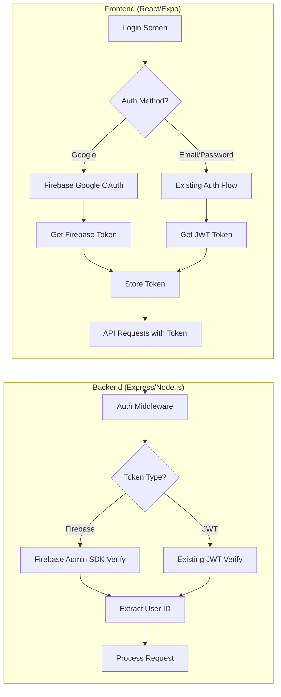
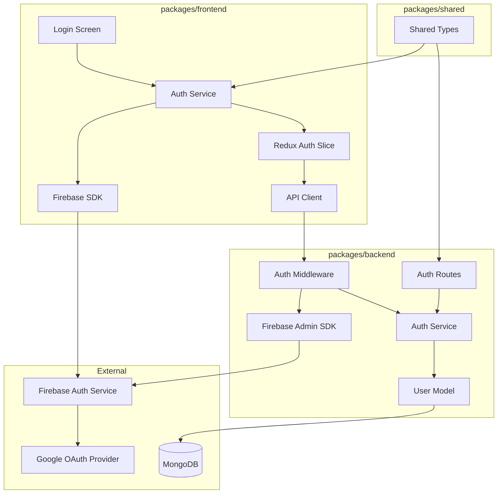
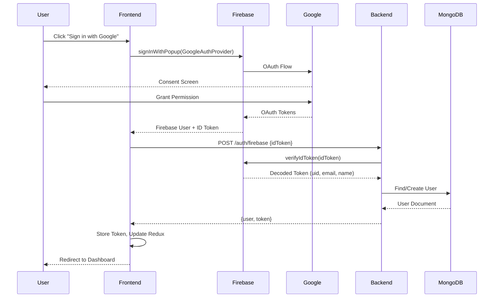

# Technical Design Document: Firebase OAuth Integration

## Overview

This document describes the technical design for integrating Firebase Authentication with Google OAuth into the Personal Kanban Board application. The integration adds Google sign-in capability while maintaining full backward compatibility with the existing email/password authentication system.

### Goals

1. **Seamless Google Sign-In**: Enable users to authenticate using their Google accounts via Firebase Authentication
2. **Backward Compatibility**: Preserve existing email/password authentication without disruption
3. **Account Linking**: Allow users to link Google credentials to existing email/password accounts
4. **Secure Token Management**: Implement Firebase token verification on the backend with automatic token refresh on the frontend
5. **Future Extensibility**: Establish foundation for permissions and credentials management for bot/AI integrations

### Non-Goals

- Migration of existing users to Firebase-only authentication
- Support for other OAuth providers (Facebook, Apple, etc.) in this iteration
- Implementation of multi-factor authentication
- Full permissions/credentials management (only foundation in this iteration)

### Technical Approach

The integration follows a dual-token architecture where:
- **Firebase tokens** are used for Google OAuth users and linked accounts
- **Existing JWT tokens** continue to work for email/password-only users
- The backend middleware detects token type and validates accordingly



## Architecture

### System Architecture

The Firebase OAuth integration spans three packages in the monorepo:



### Authentication Flow Sequence



## Components and Interfaces

### Frontend Components

#### 1. Firebase Configuration (`packages/frontend/src/config/firebase.ts`)

```typescript
import { initializeApp, FirebaseApp } from 'firebase/app';
import { getAuth, Auth } from 'firebase/auth';

interface FirebaseConfig {
  apiKey: string;
  authDomain: string;
  projectId: string;
  storageBucket: string;
  messagingSenderId: string;
  appId: string;
}

let app: FirebaseApp | null = null;
let auth: Auth | null = null;

export function initializeFirebase(): { app: FirebaseApp; auth: Auth } | null {
  const config: FirebaseConfig = {
    apiKey: process.env.EXPO_PUBLIC_FIREBASE_API_KEY || '',
    authDomain: process.env.EXPO_PUBLIC_FIREBASE_AUTH_DOMAIN || '',
    projectId: process.env.EXPO_PUBLIC_FIREBASE_PROJECT_ID || '',
    storageBucket: process.env.EXPO_PUBLIC_FIREBASE_STORAGE_BUCKET || '',
    messagingSenderId: process.env.EXPO_PUBLIC_FIREBASE_MESSAGING_SENDER_ID || '',
    appId: process.env.EXPO_PUBLIC_FIREBASE_APP_ID || '',
  };

  // Validate required config
  if (!config.apiKey || !config.projectId) {
    console.error('Firebase configuration is incomplete');
    return null;
  }

  try {
    app = initializeApp(config);
    auth = getAuth(app);
    return { app, auth };
  } catch (error) {
    console.error('Failed to initialize Firebase:', error);
    return null;
  }
}

export function getFirebaseAuth(): Auth | null {
  return auth;
}
```

#### 2. Firebase Auth Service (`packages/frontend/src/services/firebaseAuth.ts`)

```typescript
import {
  signInWithPopup,
  GoogleAuthProvider,
  signOut,
  onAuthStateChanged,
  User as FirebaseUser,
  AuthError,
} from 'firebase/auth';
import { getFirebaseAuth } from '@/config/firebase';

export interface FirebaseAuthResult {
  user: FirebaseUser;
  idToken: string;
}

export type FirebaseAuthError = 
  | 'popup-blocked'
  | 'account-disabled'
  | 'network-error'
  | 'cancelled'
  | 'unknown';

export async function signInWithGoogle(): Promise<FirebaseAuthResult> {
  const auth = getFirebaseAuth();
  if (!auth) {
    throw new Error('Firebase not initialized');
  }

  const provider = new GoogleAuthProvider();
  provider.addScope('email');
  provider.addScope('profile');

  const result = await signInWithPopup(auth, provider);
  const idToken = await result.user.getIdToken();

  return {
    user: result.user,
    idToken,
  };
}

export async function signOutFirebase(): Promise<void> {
  const auth = getFirebaseAuth();
  if (auth) {
    await signOut(auth);
  }
}

export async function refreshFirebaseToken(): Promise<string | null> {
  const auth = getFirebaseAuth();
  if (!auth?.currentUser) {
    return null;
  }
  return auth.currentUser.getIdToken(true);
}

export function subscribeToAuthState(
  callback: (user: FirebaseUser | null) => void
): () => void {
  const auth = getFirebaseAuth();
  if (!auth) {
    return () => {};
  }
  return onAuthStateChanged(auth, callback);
}

export function mapFirebaseError(error: AuthError): FirebaseAuthError {
  switch (error.code) {
    case 'auth/popup-blocked':
      return 'popup-blocked';
    case 'auth/user-disabled':
      return 'account-disabled';
    case 'auth/network-request-failed':
      return 'network-error';
    case 'auth/popup-closed-by-user':
    case 'auth/cancelled-popup-request':
      return 'cancelled';
    default:
      return 'unknown';
  }
}
```

#### 3. Updated Auth Slice (`packages/frontend/src/store/slices/authSlice.ts`)

New async thunks and state additions:

```typescript
// Additional state fields
export interface AuthState {
  // ... existing fields
  firebaseInitialized: boolean;
  firebaseError: string | null;
  authProvider: 'email' | 'google' | 'linked' | null;
  isCheckingAuth: boolean;
}

// New async thunk for Google sign-in
export const loginWithGoogle = createAsyncThunk<
  AuthResponse,
  void,
  { rejectValue: { message: string; errorType: FirebaseAuthError } }
>('auth/loginWithGoogle', async (_, { rejectWithValue }) => {
  try {
    const { idToken } = await signInWithGoogle();
    const response = await apiClient.post<AuthResponse>('/auth/firebase', { idToken });
    return response.data;
  } catch (error) {
    if (error instanceof AuthError) {
      const errorType = mapFirebaseError(error);
      return rejectWithValue({ message: getErrorMessage(errorType), errorType });
    }
    return rejectWithValue({ message: 'Google sign-in failed', errorType: 'unknown' });
  }
});

// New async thunk for checking existing Firebase session
export const checkFirebaseSession = createAsyncThunk<
  AuthResponse | null,
  void,
  { rejectValue: string }
>('auth/checkFirebaseSession', async (_, { rejectWithValue }) => {
  try {
    const token = await refreshFirebaseToken();
    if (!token) {
      return null;
    }
    const response = await apiClient.post<AuthResponse>('/auth/firebase', { idToken: token });
    return response.data;
  } catch (error) {
    return rejectWithValue('Session verification failed');
  }
});
```

### Backend Components

#### 1. Firebase Admin Configuration (`packages/backend/src/config/firebase.ts`)

```typescript
import * as admin from 'firebase-admin';

let firebaseApp: admin.app.App | null = null;

export function initializeFirebaseAdmin(): admin.app.App | null {
  if (firebaseApp) {
    return firebaseApp;
  }

  const serviceAccount = process.env.FIREBASE_SERVICE_ACCOUNT_KEY;
  const projectId = process.env.FIREBASE_PROJECT_ID;

  if (!serviceAccount || !projectId) {
    console.error('Firebase Admin SDK configuration is incomplete');
    return null;
  }

  try {
    firebaseApp = admin.initializeApp({
      credential: admin.credential.cert(JSON.parse(serviceAccount)),
      projectId,
    });
    console.log('Firebase Admin SDK initialized successfully');
    return firebaseApp;
  } catch (error) {
    console.error('Failed to initialize Firebase Admin SDK:', error);
    return null;
  }
}

export function getFirebaseAdmin(): admin.app.App | null {
  return firebaseApp;
}

export async function verifyFirebaseToken(
  idToken: string
): Promise<admin.auth.DecodedIdToken> {
  if (!firebaseApp) {
    throw new Error('Firebase Admin SDK not initialized');
  }
  
  const decodedToken = await admin.auth(firebaseApp).verifyIdToken(idToken, true);
  
  // Validate audience and issuer
  const projectId = process.env.FIREBASE_PROJECT_ID;
  if (decodedToken.aud !== projectId) {
    throw new Error('Token audience mismatch');
  }
  
  const expectedIssuer = `https://securetoken.google.com/${projectId}`;
  if (decodedToken.iss !== expectedIssuer) {
    throw new Error('Token issuer mismatch');
  }
  
  return decodedToken;
}
```

#### 2. Updated Auth Middleware (`packages/backend/src/middleware/auth.ts`)

```typescript
import { Request, Response, NextFunction } from 'express';
import { verifyToken as verifyJwtToken, JwtPayload } from '../services/auth.service';
import { verifyFirebaseToken } from '../config/firebase';
import { User } from '../models/User';
import { createError } from './errorHandler';

export interface AuthenticatedRequest extends Request {
  user?: {
    userId: string;
    authProvider: 'email' | 'google' | 'linked';
  };
}

function isFirebaseToken(token: string): boolean {
  // Firebase tokens are longer and have a specific structure
  // They typically start with 'eyJ' and have 3 parts separated by dots
  const parts = token.split('.');
  if (parts.length !== 3) return false;
  
  try {
    const header = JSON.parse(Buffer.from(parts[0], 'base64').toString());
    // Firebase tokens have 'kid' (key ID) in header, our JWTs don't
    return 'kid' in header;
  } catch {
    return false;
  }
}

export async function authenticate(
  req: AuthenticatedRequest,
  _res: Response,
  next: NextFunction
): Promise<void> {
  try {
    const authHeader = req.headers.authorization;

    if (!authHeader) {
      throw createError('No authorization header provided', 401);
    }

    const parts = authHeader.split(' ');
    if (parts.length !== 2 || parts[0] !== 'Bearer') {
      throw createError('Invalid authorization header format', 401);
    }

    const token = parts[1];
    if (!token) {
      throw createError('Token is missing', 401);
    }

    let userId: string;
    let authProvider: 'email' | 'google' | 'linked';

    if (isFirebaseToken(token)) {
      // Verify Firebase token
      try {
        const decodedToken = await verifyFirebaseToken(token);
        
        // Find user by Firebase UID
        const user = await User.findOne({ firebaseUid: decodedToken.uid });
        if (!user) {
          throw createError('User not found', 401);
        }
        
        userId = String(user._id);
        authProvider = user.authProvider;
      } catch (error) {
        // Log for security monitoring but don't expose details
        console.error('Firebase token verification failed:', error);
        throw createError('Invalid or expired token', 401);
      }
    } else {
      // Verify existing JWT token
      try {
        const payload: JwtPayload = verifyJwtToken(token);
        userId = payload.userId;
        
        // Get auth provider from user
        const user = await User.findById(userId);
        authProvider = user?.authProvider || 'email';
      } catch (error) {
        if (error instanceof Error) {
          if (error.name === 'TokenExpiredError') {
            throw createError('Token has expired', 401);
          }
        }
        throw createError('Invalid token', 401);
      }
    }

    req.user = { userId, authProvider };
    next();
  } catch (error) {
    next(error);
  }
}
```

#### 3. Firebase Auth Routes (`packages/backend/src/routes/auth.ts`)

New endpoint additions:

```typescript
/**
 * POST /api/auth/firebase
 * Authenticate with Firebase ID token (Google OAuth)
 */
router.post('/firebase', async (req: Request, res: Response, next: NextFunction): Promise<void> => {
  try {
    const { idToken } = req.body;

    if (!idToken) {
      throw createError('Firebase ID token is required', 400);
    }

    // Verify the Firebase token
    let decodedToken;
    try {
      decodedToken = await verifyFirebaseToken(idToken);
    } catch (error) {
      console.error('Firebase token verification failed:', error);
      throw createError('Invalid Firebase token', 401);
    }

    const { uid, email, name } = decodedToken;

    if (!email) {
      throw createError('Email is required from Google account', 400);
    }

    // Find or create user
    let user = await User.findOne({ 
      $or: [
        { firebaseUid: uid },
        { email: email.toLowerCase() }
      ]
    });

    if (user) {
      // Existing user - check if we need to link accounts
      if (!user.firebaseUid) {
        // Link Google to existing email/password account
        user.firebaseUid = uid;
        user.authProvider = 'linked';
        if (name && !user.displayName) {
          user.displayName = name;
        }
        await user.save();
      }
    } else {
      // Create new user
      user = await User.create({
        email: email.toLowerCase(),
        firebaseUid: uid,
        displayName: name || email.split('@')[0],
        authProvider: 'google',
        passwordHash: '', // No password for Google-only users
      });
    }

    // Generate our JWT for API authentication
    const token = generateToken(String(user._id));

    const response: AuthResponse = {
      user: transformUser(user),
      token,
    };

    res.status(200).json(response);
  } catch (error) {
    next(error);
  }
});

/**
 * POST /api/auth/link-google
 * Link Google account to existing email/password account
 */
router.post('/link-google', authenticate, async (req: AuthenticatedRequest, res: Response, next: NextFunction): Promise<void> => {
  try {
    const { idToken } = req.body;
    const userId = req.user?.userId;

    if (!idToken) {
      throw createError('Firebase ID token is required', 400);
    }

    const decodedToken = await verifyFirebaseToken(idToken);
    const { uid, email: googleEmail } = decodedToken;

    const user = await User.findById(userId);
    if (!user) {
      throw createError('User not found', 404);
    }

    // Check if Google email matches user email
    if (googleEmail?.toLowerCase() !== user.email.toLowerCase()) {
      throw createError('Google account email does not match your account email', 400);
    }

    // Check if Firebase UID is already linked to another account
    const existingFirebaseUser = await User.findOne({ firebaseUid: uid });
    if (existingFirebaseUser && String(existingFirebaseUser._id) !== userId) {
      throw createError('This Google account is already linked to another user', 409);
    }

    // Link the accounts
    user.firebaseUid = uid;
    user.authProvider = 'linked';
    await user.save();

    res.status(200).json({
      message: 'Google account linked successfully',
      user: transformUser(user),
    });
  } catch (error) {
    next(error);
  }
});
```

### Shared Types

#### Updated Types (`packages/shared/src/index.ts`)

```typescript
// Auth Provider Types
export type AuthProvider = 'email' | 'google' | 'linked';

// Updated User interface
export interface User {
  id: string;
  email: string;
  displayName: string;
  authProvider: AuthProvider;
  createdAt: string;
  updatedAt: string;
}

// Firebase Auth Request
export interface FirebaseAuthRequest {
  idToken: string;
}

// Link Google Request
export interface LinkGoogleRequest {
  idToken: string;
}

// Link Google Response
export interface LinkGoogleResponse {
  message: string;
  user: User;
}

// Firebase Auth Error Types
export type FirebaseAuthErrorType = 
  | 'popup-blocked'
  | 'account-disabled'
  | 'network-error'
  | 'cancelled'
  | 'unknown';
```

## Data Models

### Updated User Model (`packages/backend/src/models/User.ts`)

```typescript
import mongoose, { Schema, Document, Model } from 'mongoose';
import bcrypt from 'bcrypt';

export type AuthProvider = 'email' | 'google' | 'linked';

export interface IUser {
  email: string;
  passwordHash: string;
  displayName: string;
  firebaseUid: string | null;
  authProvider: AuthProvider;
  // Streak fields
  currentStreak: number;
  longestStreak: number;
  lastCheckInDate: Date | null;
  totalCheckIns: number;
  // Future permissions management
  permissions: string[];
  credentials: {
    apiKeys: Array<{
      name: string;
      keyHash: string;
      createdAt: Date;
      lastUsedAt: Date | null;
      expiresAt: Date | null;
    }>;
    botTokens: Array<{
      service: string;
      tokenHash: string;
      createdAt: Date;
      expiresAt: Date | null;
    }>;
  };
  createdAt: Date;
  updatedAt: Date;
}

export interface IUserDocument extends IUser, Document {
  comparePassword(candidatePassword: string): Promise<boolean>;
}

export interface IUserModel extends Model<IUserDocument> {
  findByEmail(email: string): Promise<IUserDocument | null>;
  findByFirebaseUid(uid: string): Promise<IUserDocument | null>;
  hashPassword(password: string): Promise<string>;
}

const userSchema = new Schema<IUserDocument, IUserModel>(
  {
    email: {
      type: String,
      required: [true, 'Email is required'],
      unique: true,
      lowercase: true,
      trim: true,
      maxlength: [255, 'Email cannot exceed 255 characters'],
      match: [/^\S+@\S+\.\S+$/, 'Please provide a valid email address'],
    },
    passwordHash: {
      type: String,
      required: function(this: IUserDocument) {
        // Password is required only for email auth provider
        return this.authProvider === 'email';
      },
      default: '',
    },
    displayName: {
      type: String,
      required: [true, 'Display name is required'],
      trim: true,
      maxlength: [100, 'Display name cannot exceed 100 characters'],
    },
    firebaseUid: {
      type: String,
      unique: true,
      sparse: true, // Allows null values while maintaining uniqueness
      default: null,
    },
    authProvider: {
      type: String,
      enum: ['email', 'google', 'linked'],
      default: 'email',
    },
    // Streak fields
    currentStreak: { type: Number, default: 0 },
    longestStreak: { type: Number, default: 0 },
    lastCheckInDate: { type: Date, default: null },
    totalCheckIns: { type: Number, default: 0 },
    // Future permissions management
    permissions: {
      type: [String],
      default: [],
    },
    credentials: {
      apiKeys: [{
        name: String,
        keyHash: String,
        createdAt: { type: Date, default: Date.now },
        lastUsedAt: Date,
        expiresAt: Date,
      }],
      botTokens: [{
        service: String,
        tokenHash: String,
        createdAt: { type: Date, default: Date.now },
        expiresAt: Date,
      }],
    },
  },
  { timestamps: true }
);

// Indexes
userSchema.index({ email: 1 });
userSchema.index({ firebaseUid: 1 }, { sparse: true });

// Static methods
userSchema.statics.findByEmail = function(email: string): Promise<IUserDocument | null> {
  return this.findOne({ email: email.toLowerCase() });
};

userSchema.statics.findByFirebaseUid = function(uid: string): Promise<IUserDocument | null> {
  return this.findOne({ firebaseUid: uid });
};

userSchema.statics.hashPassword = async function(password: string): Promise<string> {
  const SALT_ROUNDS = 12;
  return bcrypt.hash(password, SALT_ROUNDS);
};

// Instance methods
userSchema.methods.comparePassword = async function(candidatePassword: string): Promise<boolean> {
  if (!this.passwordHash) {
    return false;
  }
  return bcrypt.compare(candidatePassword, this.passwordHash);
};

// Validation: firebaseUid required for google/linked providers
userSchema.pre('save', function(next) {
  if ((this.authProvider === 'google' || this.authProvider === 'linked') && !this.firebaseUid) {
    next(new Error('Firebase UID is required for Google or linked authentication'));
  }
  next();
});

// Transform for JSON output
userSchema.set('toJSON', {
  transform: (_doc, ret) => {
    const obj = ret as Record<string, unknown>;
    obj.id = obj._id;
    delete obj._id;
    delete obj.passwordHash;
    delete obj.__v;
    delete obj.credentials; // Never expose credentials
    return ret;
  },
});

export const User = mongoose.model<IUserDocument, IUserModel>('User', userSchema);
export default User;
```

### Database Migration

A migration script will be needed to add the new fields to existing users:

```typescript
// packages/backend/src/migrations/add-firebase-fields.ts
import mongoose from 'mongoose';
import { User } from '../models/User';

export async function migrateAddFirebaseFields(): Promise<void> {
  const result = await User.updateMany(
    { authProvider: { $exists: false } },
    { 
      $set: { 
        authProvider: 'email',
        firebaseUid: null,
        permissions: [],
        credentials: { apiKeys: [], botTokens: [] }
      } 
    }
  );
  
  console.log(`Migration complete: ${result.modifiedCount} users updated`);
}
```


## Correctness Properties

*A property is a characteristic or behavior that should hold true across all valid executions of a system—essentially, a formal statement about what the system should do. Properties serve as the bridge between human-readable specifications and machine-verifiable correctness guarantees.*

### Property 1: Firebase Token Verification

*For any* valid Firebase ID token received by the Backend_API, the authentication middleware SHALL verify the token using Firebase Admin SDK and extract the user's Firebase UID, email, and claims.

**Validates: Requirements 2.5, 4.5**

### Property 2: User Creation from Google OAuth

*For any* valid Firebase user data (uid, email, displayName) where no existing user matches the email, the Backend_API SHALL create a new User_Model with:
- `firebaseUid` set to the Firebase UID
- `email` set to the Google account email (lowercase)
- `displayName` set to the Google account name
- `authProvider` set to 'google'

**Validates: Requirements 3.1, 3.3**

### Property 3: Account Linking

*For any* existing User_Model with `authProvider` 'email' and matching email address, when the user signs in with Google OAuth, the Backend_API SHALL:
- Set `firebaseUid` to the Firebase UID
- Update `authProvider` to 'linked'
- Preserve all existing user data and associations

**Validates: Requirements 3.2, 3.6, 5.5**

### Property 4: Firebase UID Invariant

*For any* User_Model document where `authProvider` is 'google' or 'linked', the `firebaseUid` field SHALL be non-null and contain a valid Firebase user identifier.

**Validates: Requirements 3.7**

### Property 5: Authorization Header Inclusion

*For any* authenticated API request made by the Frontend_App, the request SHALL include an `Authorization` header with the format `Bearer <token>` where `<token>` is either a Firebase ID token or an existing JWT token.

**Validates: Requirements 4.2**

### Property 6: Dual Token Support

*For any* token received in the Authorization header, the Backend_API authentication middleware SHALL:
- Detect the token type (Firebase or JWT) based on token structure
- Use Firebase Admin SDK verification for Firebase tokens
- Use existing JWT verification for legacy tokens
- Return the authenticated user ID regardless of token type

**Validates: Requirements 5.2, 5.4**

### Property 7: Authentication State Synchronization

*For any* change in Firebase authentication state (sign-in, sign-out, token refresh), the Frontend_App SHALL update the Redux auth state to reflect the current authentication status within 1 second.

**Validates: Requirements 6.3**

### Property 8: Comprehensive Token Validation

*For any* Firebase token, the Backend_API SHALL reject the token with a 401 response if:
- The token has been revoked
- The token audience does not match the application's Firebase project ID
- The token issuer does not match `https://securetoken.google.com/{projectId}`

**Validates: Requirements 8.1, 8.2, 8.3**

### Property 9: Error Message Sanitization

*For any* token validation error that occurs in the Backend_API, the error response to the client SHALL contain a generic error message without exposing internal error details, stack traces, or sensitive information.

**Validates: Requirements 8.6**

### Property 10: Credential Cleanup on Deletion

*For any* user account deletion, the Backend_API SHALL revoke and remove all associated:
- API keys stored in the credentials field
- Bot tokens stored in the credentials field
- Permission grants stored in the permissions field

**Validates: Requirements 9.5**

## Error Handling

### Frontend Error Handling

| Error Scenario | Error Code | User Message | Recovery Action |
|----------------|------------|--------------|-----------------|
| Firebase not initialized | `FIREBASE_INIT_ERROR` | "Authentication services are unavailable. Please try again later." | Display error, disable Google sign-in button |
| Popup blocked | `auth/popup-blocked` | "Please allow popups for this site to sign in with Google." | Show instructions to enable popups |
| Account disabled | `auth/user-disabled` | "This Google account has been disabled and cannot be used." | Suggest using email/password or different account |
| Network error | `auth/network-request-failed` | "Unable to connect. Please check your internet connection." | Show offline indicator, retry button |
| User cancelled | `auth/popup-closed-by-user` | (No message) | Return to login screen silently |
| Token refresh failed | `TOKEN_REFRESH_FAILED` | "Your session has expired. Please sign in again." | Redirect to login screen |
| Auth timeout | `AUTH_TIMEOUT` | "Authentication is taking too long. Please try again." | Redirect to login screen |
| Email mismatch on linking | `EMAIL_MISMATCH` | "The Google account email doesn't match your account. Continue anyway?" | Show confirmation dialog |

### Backend Error Handling

| Error Scenario | HTTP Status | Error Code | Response Message |
|----------------|-------------|------------|------------------|
| Missing authorization header | 401 | `UNAUTHORIZED` | "No authorization header provided" |
| Invalid header format | 401 | `UNAUTHORIZED` | "Invalid authorization header format" |
| Invalid Firebase token | 401 | `UNAUTHORIZED` | "Invalid or expired token" |
| Token revoked | 401 | `TOKEN_REVOKED` | "Token has been revoked" |
| Audience mismatch | 401 | `UNAUTHORIZED` | "Invalid token" |
| Issuer mismatch | 401 | `UNAUTHORIZED` | "Invalid token" |
| Firebase Admin not initialized | 503 | `SERVICE_UNAVAILABLE` | "Authentication service unavailable" |
| User not found | 401 | `UNAUTHORIZED` | "User not found" |
| Email already linked | 409 | `CONFLICT` | "This Google account is already linked to another user" |
| Missing Firebase token | 400 | `VALIDATION_ERROR` | "Firebase ID token is required" |

### Error Logging Strategy

```typescript
// Security-sensitive errors are logged with context but sanitized for client response
interface AuthErrorLog {
  timestamp: Date;
  requestId: string;
  errorType: string;
  userId?: string;
  firebaseUid?: string;
  ipAddress: string;
  userAgent: string;
  // Internal details (never sent to client)
  internalError?: string;
  stackTrace?: string;
}
```

## Testing Strategy

### Unit Tests

Unit tests focus on specific examples and edge cases:

**Frontend Unit Tests:**
- Firebase configuration initialization with valid/invalid config
- Google sign-in button renders on login screen
- Error message mapping for each Firebase error type
- Redux auth slice state transitions
- Token storage and retrieval from AsyncStorage
- Logout clears Firebase session and Redux state

**Backend Unit Tests:**
- Token type detection (Firebase vs JWT)
- User creation with valid Firebase data
- Account linking with matching email
- Account linking rejection with mismatched email
- Error response formatting (no internal details exposed)
- User model validation (firebaseUid required for google/linked)

### Property-Based Tests

Property-based tests verify universal properties across many generated inputs. Each test runs minimum 100 iterations.

**Test Configuration:**
- Library: `fast-check` (already in devDependencies)
- Minimum iterations: 100
- Shrinking enabled for failure case minimization

**Property Tests to Implement:**

```typescript
// Feature: firebase-oauth-integration, Property 2: User Creation from Google OAuth
describe('User Creation from Google OAuth', () => {
  it('creates user with correct fields for any valid Firebase data', () => {
    fc.assert(
      fc.property(
        fc.record({
          uid: fc.string({ minLength: 1, maxLength: 128 }),
          email: fc.emailAddress(),
          displayName: fc.string({ minLength: 1, maxLength: 100 }),
        }),
        async (firebaseUser) => {
          const user = await createUserFromFirebase(firebaseUser);
          expect(user.firebaseUid).toBe(firebaseUser.uid);
          expect(user.email).toBe(firebaseUser.email.toLowerCase());
          expect(user.authProvider).toBe('google');
        }
      ),
      { numRuns: 100 }
    );
  });
});

// Feature: firebase-oauth-integration, Property 4: Firebase UID Invariant
describe('Firebase UID Invariant', () => {
  it('ensures firebaseUid is non-null for google/linked providers', () => {
    fc.assert(
      fc.property(
        fc.record({
          email: fc.emailAddress(),
          authProvider: fc.constantFrom('google', 'linked'),
          firebaseUid: fc.option(fc.string({ minLength: 1 }), { nil: null }),
        }),
        async (userData) => {
          if (userData.firebaseUid === null) {
            await expect(User.create(userData)).rejects.toThrow();
          } else {
            const user = await User.create(userData);
            expect(user.firebaseUid).not.toBeNull();
          }
        }
      ),
      { numRuns: 100 }
    );
  });
});

// Feature: firebase-oauth-integration, Property 6: Dual Token Support
describe('Dual Token Support', () => {
  it('correctly identifies and verifies both token types', () => {
    fc.assert(
      fc.property(
        fc.oneof(
          fc.record({ type: fc.constant('firebase'), token: generateMockFirebaseToken() }),
          fc.record({ type: fc.constant('jwt'), token: generateMockJwtToken() })
        ),
        async ({ type, token }) => {
          const detectedType = isFirebaseToken(token) ? 'firebase' : 'jwt';
          expect(detectedType).toBe(type);
        }
      ),
      { numRuns: 100 }
    );
  });
});

// Feature: firebase-oauth-integration, Property 9: Error Message Sanitization
describe('Error Message Sanitization', () => {
  it('never exposes internal details in error responses', () => {
    fc.assert(
      fc.property(
        fc.record({
          internalMessage: fc.string(),
          stackTrace: fc.string(),
          sensitiveData: fc.string(),
        }),
        (errorDetails) => {
          const response = formatAuthError(new Error(errorDetails.internalMessage));
          expect(response.message).not.toContain(errorDetails.internalMessage);
          expect(response.message).not.toContain(errorDetails.stackTrace);
          expect(JSON.stringify(response)).not.toContain('stack');
        }
      ),
      { numRuns: 100 }
    );
  });
});
```

### Integration Tests

Integration tests verify end-to-end flows with real or mocked external services:

1. **Google OAuth Flow** (mocked Firebase)
   - Complete sign-in flow from button click to authenticated state
   - Token refresh when expired
   - Logout clears all state

2. **Account Linking Flow**
   - Existing email user links Google account
   - Verify all existing data preserved after linking
   - Reject linking when email doesn't match

3. **Dual Authentication**
   - Email/password user can still authenticate
   - Google user can authenticate
   - Linked user can use either method

4. **Backend Token Validation**
   - Valid Firebase token accepted
   - Valid JWT token accepted
   - Expired tokens rejected
   - Malformed tokens rejected

### Test Coverage Requirements

| Component | Minimum Coverage |
|-----------|------------------|
| Firebase config (frontend) | 80% |
| Firebase auth service | 90% |
| Auth slice (Redux) | 85% |
| Auth middleware (backend) | 95% |
| Auth routes (backend) | 90% |
| User model | 85% |

### Test Environment Setup

```typescript
// jest.setup.ts additions
jest.mock('firebase/app');
jest.mock('firebase/auth');
jest.mock('firebase-admin');

// Mock Firebase Auth for frontend tests
const mockFirebaseAuth = {
  signInWithPopup: jest.fn(),
  signOut: jest.fn(),
  onAuthStateChanged: jest.fn(),
  currentUser: null,
};

// Mock Firebase Admin for backend tests
const mockFirebaseAdmin = {
  auth: () => ({
    verifyIdToken: jest.fn(),
  }),
};
```
