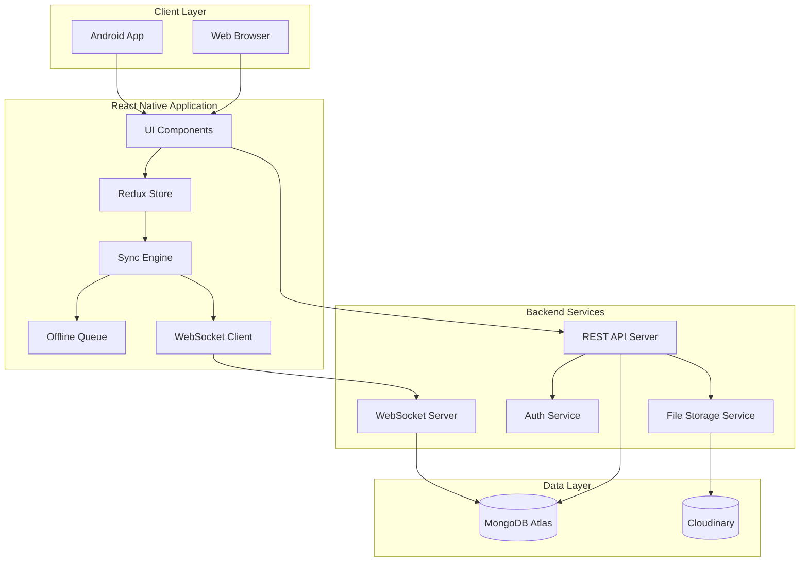
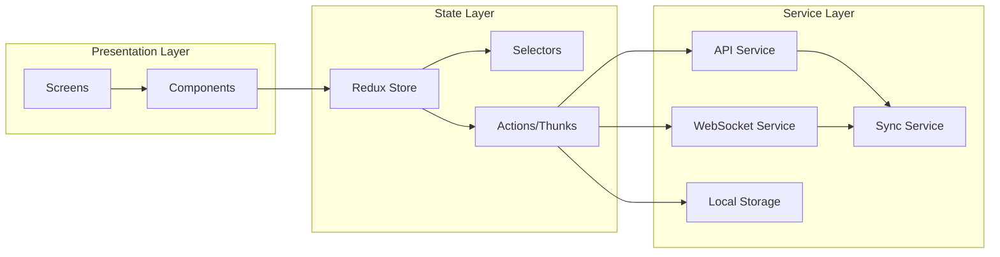
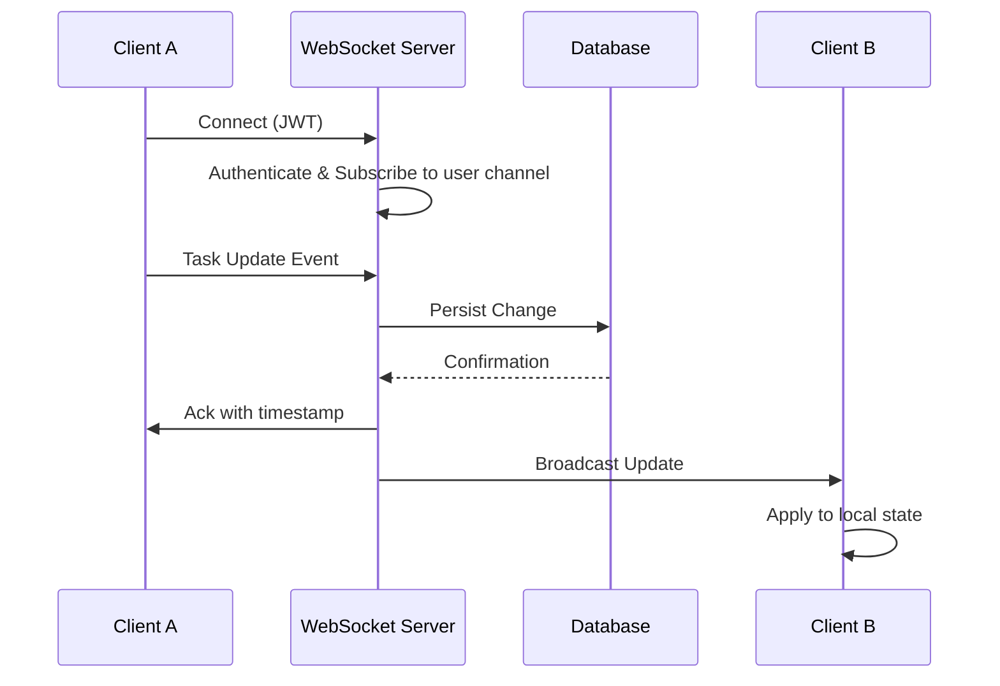
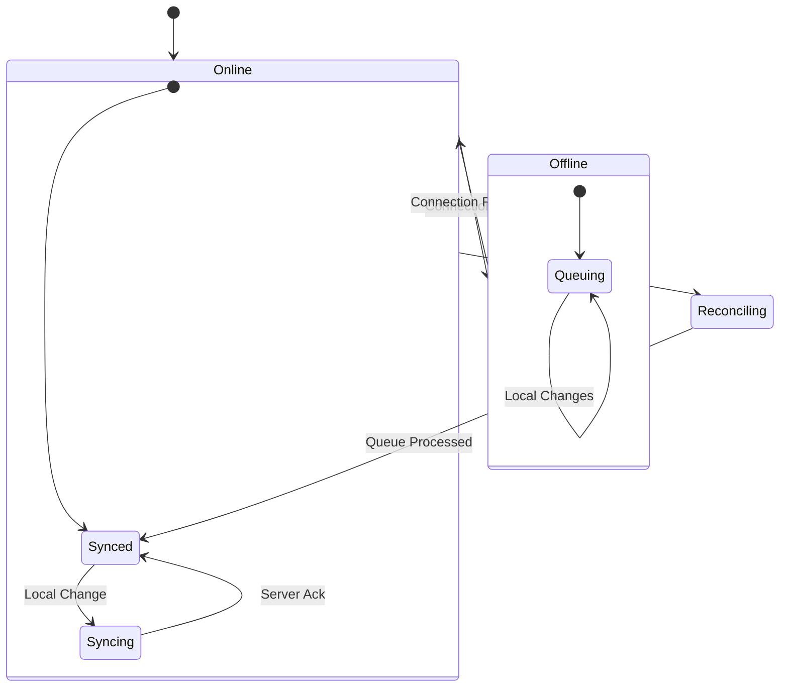
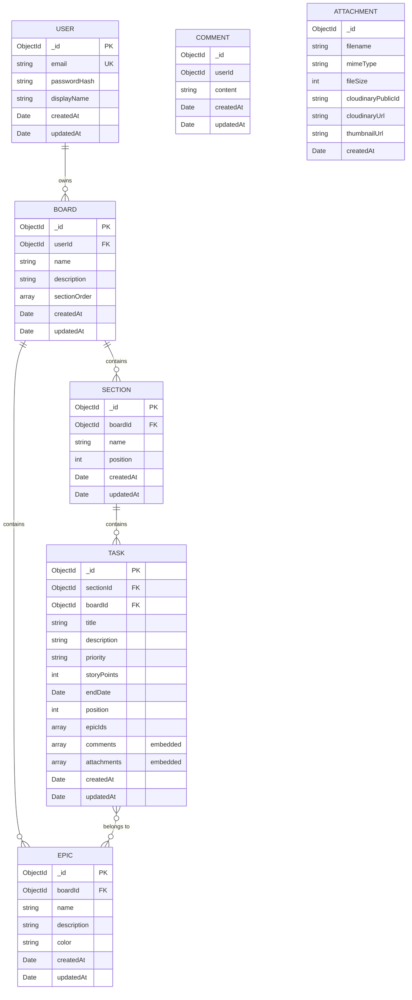
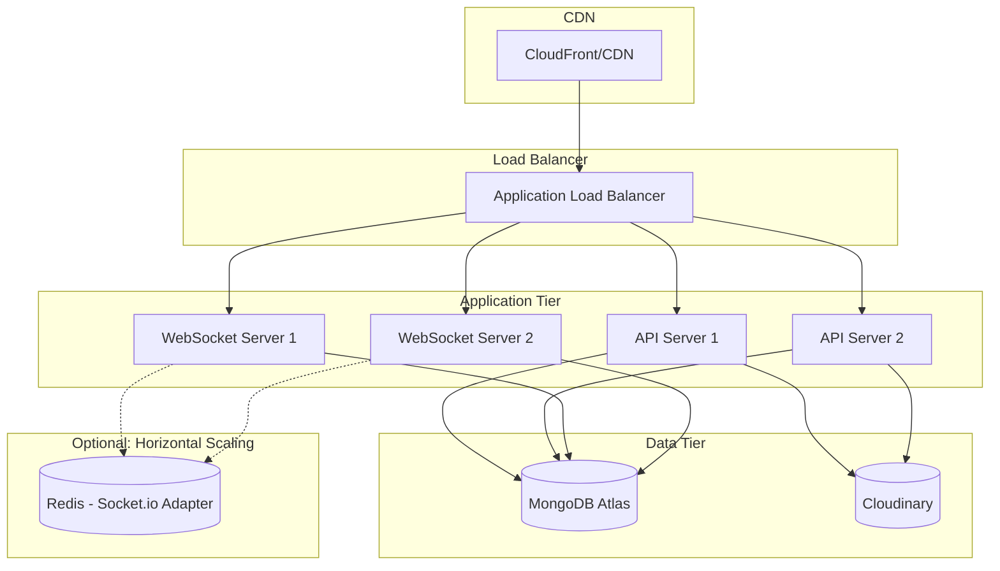

# Technical Design Document: Personal Kanban Board

## Overview

Personal Kanban Board is a cross-platform task management application built with React Native for web and Android deployment. The system follows a client-server architecture with real-time synchronization capabilities, enabling users to manage tasks across multiple devices with automatic updates.

### Key Design Goals

1. **Cross-Platform Consistency**: Single React Native codebase serving web and Android with feature parity
2. **Real-Time Collaboration**: WebSocket-based synchronization ensuring changes propagate within 3 seconds
3. **Offline Resilience**: Local-first data management with automatic sync on reconnection
4. **Responsive Experience**: Adaptive layouts for mobile, tablet, and desktop viewports
5. **Scalable Architecture**: Modular component design supporting future feature expansion

### Technology Stack

| Layer | Technology | Rationale |
|-------|------------|-----------|
| Frontend | React Native + React Native Web | Cross-platform from single codebase |
| State Management | Redux Toolkit + RTK Query | Predictable state with built-in caching |
| Real-Time | WebSocket (Socket.io) | Bi-directional real-time communication |
| Backend | Node.js + Express | JavaScript ecosystem consistency |
| Database | MongoDB Atlas (free tier) | Document-based storage with flexible schema |
| ODM | Mongoose | Schema validation and query building |
| File Storage | Cloudinary (free tier) / MongoDB GridFS | Scalable media attachment storage with transformations |
| Authentication | JWT + bcrypt | Stateless auth with secure password hashing |

> **Note on Horizontal Scaling**: The current implementation uses Socket.io's in-memory adapter for WebSocket connections. For horizontal scaling across multiple server instances, add the `@socket.io/redis-adapter` package and configure a Redis instance. This is a drop-in change that doesn't affect the application code.

---

## Architecture

### System Architecture Diagram



### Client Architecture

The client follows a layered architecture pattern:



### Real-Time Sync Architecture



### Offline Sync Flow



---

## Components and Interfaces

### Frontend Component Hierarchy

```
App
├── AuthProvider
│   ├── LoginScreen
│   └── RegisterScreen
├── MainNavigator
│   ├── BoardListScreen
│   │   ├── BoardCard
│   │   └── CreateBoardModal
│   ├── BoardScreen
│   │   ├── BoardHeader
│   │   │   ├── FilterBar
│   │   │   ├── SearchInput
│   │   │   └── SyncStatusIndicator
│   │   ├── SectionList
│   │   │   ├── Section
│   │   │   │   ├── SectionHeader
│   │   │   │   └── TaskList
│   │   │   │       └── TaskCard
│   │   │   └── AddSectionButton
│   │   └── FilterPanel
│   │       ├── EpicFilter
│   │       ├── PriorityFilter
│   │       └── DueDateFilter
│   └── TaskDetailScreen
│       ├── TaskHeader
│       ├── TaskProperties
│       ├── EpicSelector
│       ├── CommentList
│       │   └── CommentItem
│       └── AttachmentList
│           └── AttachmentItem
└── SettingsScreen
    └── ExportDataButton
```

### Core Component Interfaces

#### BoardScreen Component

```typescript
interface BoardScreenProps {
  boardId: string;
}

interface BoardScreenState {
  sections: Section[];
  tasks: Task[];
  activeFilters: FilterState;
  searchQuery: string;
  syncStatus: SyncStatus;
}
```

#### TaskCard Component

```typescript
interface TaskCardProps {
  task: Task;
  onPress: (taskId: string) => void;
  onDragStart: (taskId: string) => void;
  onDragEnd: (taskId: string, targetSectionId: string, position: number) => void;
  isDragging: boolean;
}
```

#### FilterBar Component

```typescript
interface FilterBarProps {
  epics: Epic[];
  selectedEpicIds: string[];
  selectedPriorities: Priority[];
  selectedDueDateFilter: DueDateFilter | null;
  onEpicFilterChange: (epicIds: string[]) => void;
  onPriorityFilterChange: (priorities: Priority[]) => void;
  onDueDateFilterChange: (filter: DueDateFilter | null) => void;
  onClearFilters: () => void;
  taskCount: number;
}
```

### Backend API Interfaces

#### REST API Endpoints

| Method | Endpoint | Description |
|--------|----------|-------------|
| POST | `/api/auth/register` | User registration |
| POST | `/api/auth/login` | User authentication |
| POST | `/api/auth/logout` | Session termination |
| GET | `/api/boards` | List user boards |
| POST | `/api/boards` | Create board |
| GET | `/api/boards/:id` | Get board details |
| PUT | `/api/boards/:id` | Update board |
| DELETE | `/api/boards/:id` | Delete board |
| GET | `/api/boards/:id/sections` | List sections |
| POST | `/api/boards/:id/sections` | Create section |
| PUT | `/api/sections/:id` | Update section |
| DELETE | `/api/sections/:id` | Delete section |
| PUT | `/api/sections/reorder` | Reorder sections |
| GET | `/api/boards/:id/tasks` | List tasks with filters |
| POST | `/api/boards/:id/tasks` | Create task |
| GET | `/api/tasks/:id` | Get task details |
| PUT | `/api/tasks/:id` | Update task |
| DELETE | `/api/tasks/:id` | Delete task |
| PUT | `/api/tasks/:id/move` | Move task between sections |
| GET | `/api/boards/:id/epics` | List epics |
| POST | `/api/boards/:id/epics` | Create epic |
| PUT | `/api/epics/:id` | Update epic |
| DELETE | `/api/epics/:id` | Delete epic |
| POST | `/api/tasks/:id/epics` | Assign epic to task |
| DELETE | `/api/tasks/:id/epics/:epicId` | Remove epic from task |
| GET | `/api/tasks/:id/comments` | List comments |
| POST | `/api/tasks/:id/comments` | Add comment |
| PUT | `/api/comments/:id` | Update comment |
| DELETE | `/api/comments/:id` | Delete comment |
| GET | `/api/tasks/:id/attachments` | List attachments |
| POST | `/api/tasks/:id/attachments` | Upload attachment |
| DELETE | `/api/attachments/:id` | Delete attachment |
| GET | `/api/boards/:id/export` | Export board data |
| GET | `/api/export/all` | Export all boards |

#### WebSocket Events

```typescript
// Client -> Server Events
interface ClientEvents {
  'board:subscribe': { boardId: string };
  'board:unsubscribe': { boardId: string };
  'task:update': { taskId: string; changes: Partial<Task>; timestamp: number };
  'task:move': { taskId: string; sectionId: string; position: number; timestamp: number };
  'section:reorder': { boardId: string; sectionOrder: string[]; timestamp: number };
}

// Server -> Client Events
interface ServerEvents {
  'sync:ack': { eventId: string; serverTimestamp: number };
  'task:updated': { task: Task; updatedBy: string };
  'task:created': { task: Task };
  'task:deleted': { taskId: string };
  'task:moved': { taskId: string; sectionId: string; position: number };
  'section:updated': { section: Section };
  'section:created': { section: Section };
  'section:deleted': { sectionId: string };
  'section:reordered': { boardId: string; sectionOrder: string[] };
  'epic:updated': { epic: Epic };
  'epic:created': { epic: Epic };
  'epic:deleted': { epicId: string };
  'comment:created': { comment: Comment };
  'comment:updated': { comment: Comment };
  'comment:deleted': { commentId: string };
  'conflict:detected': { conflictInfo: ConflictInfo };
}
```

### Service Layer Interfaces

#### SyncService

```typescript
interface SyncService {
  connect(token: string): Promise<void>;
  disconnect(): void;
  subscribeToBoard(boardId: string): void;
  unsubscribeFromBoard(boardId: string): void;
  pushChange(change: LocalChange): Promise<SyncResult>;
  getConnectionStatus(): ConnectionStatus;
  onStatusChange(callback: (status: ConnectionStatus) => void): () => void;
}

type ConnectionStatus = 'connected' | 'connecting' | 'disconnected' | 'reconnecting';

interface LocalChange {
  id: string;
  type: 'create' | 'update' | 'delete' | 'move';
  entity: 'task' | 'section' | 'epic' | 'comment';
  payload: unknown;
  timestamp: number;
}

interface SyncResult {
  success: boolean;
  serverTimestamp?: number;
  conflict?: ConflictInfo;
}
```

#### OfflineQueueService

```typescript
interface OfflineQueueService {
  enqueue(change: LocalChange): void;
  dequeue(): LocalChange | null;
  peek(): LocalChange | null;
  getQueueLength(): number;
  clear(): void;
  persist(): Promise<void>;
  restore(): Promise<void>;
}
```

#### CloudinaryService

```typescript
interface CloudinaryService {
  uploadFile(file: Buffer | Stream, options: UploadOptions): Promise<UploadResult>;
  deleteFile(publicId: string): Promise<DeleteResult>;
  getSignedUrl(publicId: string, options?: TransformOptions): string;
  generateThumbnail(publicId: string, width: number, height: number): string;
}

interface UploadOptions {
  folder: string;
  resourceType: 'image' | 'raw' | 'auto';
  allowedFormats?: string[];
  maxFileSize?: number; // in bytes
  transformation?: TransformOptions;
}

interface UploadResult {
  publicId: string;
  url: string;
  secureUrl: string;
  format: string;
  bytes: number;
  width?: number;
  height?: number;
  thumbnailUrl?: string;
}

interface TransformOptions {
  width?: number;
  height?: number;
  crop?: 'fill' | 'fit' | 'scale' | 'thumb';
  quality?: 'auto' | number;
  format?: 'auto' | 'webp' | 'jpg' | 'png';
}

interface DeleteResult {
  result: 'ok' | 'not found';
}
```

---

## Data Models

### Entity Relationship Diagram



> **Note on Document Embedding**: Comments and attachments are embedded within Task documents for efficient retrieval. This is optimal for the expected use case where comments and attachments are always accessed in the context of their parent task. For tasks with very high comment/attachment counts, consider using references instead.

### TypeScript Type Definitions

```typescript
// Core Entity Types
interface User {
  id: string;
  email: string;
  displayName: string;
  createdAt: string;
  updatedAt: string;
}

interface Board {
  id: string;
  userId: string;
  name: string;
  description: string | null;
  sectionOrder: string[];
  createdAt: string;
  updatedAt: string;
}

interface Section {
  id: string;
  boardId: string;
  name: string;
  position: number;
  createdAt: string;
  updatedAt: string;
}

type Priority = 'low' | 'medium' | 'high' | 'critical';

interface Task {
  id: string;
  sectionId: string;
  boardId: string;
  title: string;
  description: string | null;
  priority: Priority | null;
  storyPoints: number | null;
  endDate: string | null;
  position: number;
  epicIds: string[];
  createdAt: string;
  updatedAt: string;
}

interface Epic {
  id: string;
  boardId: string;
  name: string;
  description: string | null;
  color: string;
  createdAt: string;
  updatedAt: string;
}

interface Comment {
  id: string;
  taskId: string;
  userId: string;
  content: string;
  createdAt: string;
  updatedAt: string;
}

interface Attachment {
  id: string;
  taskId: string;
  filename: string;
  mimeType: string;
  fileSize: number;
  cloudinaryPublicId: string;
  cloudinaryUrl: string;
  thumbnailUrl: string | null;
  createdAt: string;
}

// Filter Types
type DueDateFilter = 'today' | 'week' | '7days' | 'overdue';

interface FilterState {
  epicIds: string[];
  priorities: Priority[];
  dueDateFilter: DueDateFilter | null;
  searchQuery: string;
}

// Sync Types
type SyncStatus = 'synced' | 'syncing' | 'offline' | 'error';

interface ConflictInfo {
  entityType: 'task' | 'section' | 'epic' | 'comment';
  entityId: string;
  localVersion: unknown;
  serverVersion: unknown;
  resolvedVersion: unknown;
  resolution: 'server_wins' | 'client_wins' | 'merged';
}
```

### Mongoose Schema Definitions

```typescript
import mongoose, { Schema, Document } from 'mongoose';

// User Schema
const userSchema = new Schema({
  email: { 
    type: String, 
    required: true, 
    unique: true,
    lowercase: true,
    trim: true,
    maxlength: 255
  },
  passwordHash: { 
    type: String, 
    required: true 
  },
  displayName: { 
    type: String, 
    required: true,
    maxlength: 100
  }
}, { 
  timestamps: true 
});

userSchema.index({ email: 1 });

// Board Schema
const boardSchema = new Schema({
  userId: { 
    type: Schema.Types.ObjectId, 
    ref: 'User', 
    required: true,
    index: true
  },
  name: { 
    type: String, 
    required: true,
    maxlength: 100
  },
  description: { 
    type: String,
    maxlength: 500
  },
  sectionOrder: [{ 
    type: Schema.Types.ObjectId, 
    ref: 'Section' 
  }]
}, { 
  timestamps: true 
});

// Section Schema
const sectionSchema = new Schema({
  boardId: { 
    type: Schema.Types.ObjectId, 
    ref: 'Board', 
    required: true,
    index: true
  },
  name: { 
    type: String, 
    required: true,
    maxlength: 100
  },
  position: { 
    type: Number, 
    required: true,
    default: 0
  }
}, { 
  timestamps: true 
});

// Comment Sub-document Schema (embedded in Task)
const commentSchema = new Schema({
  userId: { 
    type: Schema.Types.ObjectId, 
    ref: 'User', 
    required: true 
  },
  content: { 
    type: String, 
    required: true 
  }
}, { 
  timestamps: true 
});

// Attachment Sub-document Schema (embedded in Task)
const attachmentSchema = new Schema({
  filename: { 
    type: String, 
    required: true,
    maxlength: 255
  },
  mimeType: { 
    type: String, 
    required: true,
    maxlength: 100
  },
  fileSize: { 
    type: Number, 
    required: true 
  },
  cloudinaryPublicId: { 
    type: String, 
    required: true 
  },
  cloudinaryUrl: { 
    type: String, 
    required: true 
  },
  thumbnailUrl: { 
    type: String 
  },
  createdAt: { 
    type: Date, 
    default: Date.now 
  }
});

// Task Schema
const taskSchema = new Schema({
  sectionId: { 
    type: Schema.Types.ObjectId, 
    ref: 'Section', 
    required: true,
    index: true
  },
  boardId: { 
    type: Schema.Types.ObjectId, 
    ref: 'Board', 
    required: true,
    index: true
  },
  title: { 
    type: String, 
    required: true,
    maxlength: 255
  },
  description: { 
    type: String 
  },
  priority: { 
    type: String, 
    enum: ['low', 'medium', 'high', 'critical', null],
    default: null
  },
  storyPoints: { 
    type: Number,
    min: 1,
    validate: {
      validator: function(v: number | null) {
        return v === null || (Number.isInteger(v) && v > 0);
      },
      message: 'Story points must be a positive integer'
    }
  },
  endDate: { 
    type: Date 
  },
  position: { 
    type: Number, 
    required: true,
    default: 0
  },
  epicIds: [{ 
    type: Schema.Types.ObjectId, 
    ref: 'Epic' 
  }],
  comments: [commentSchema],
  attachments: [attachmentSchema]
}, { 
  timestamps: true 
});

// Text index for full-text search
taskSchema.index({ title: 'text', description: 'text' });
taskSchema.index({ endDate: 1 });
taskSchema.index({ priority: 1 });
taskSchema.index({ epicIds: 1 });

// Epic Schema
const epicSchema = new Schema({
  boardId: { 
    type: Schema.Types.ObjectId, 
    ref: 'Board', 
    required: true,
    index: true
  },
  name: { 
    type: String, 
    required: true,
    maxlength: 100
  },
  description: { 
    type: String 
  },
  color: { 
    type: String, 
    default: '#6366f1',
    match: /^#[0-9A-Fa-f]{6}$/
  }
}, { 
  timestamps: true 
});

// Model exports
export const User = mongoose.model('User', userSchema);
export const Board = mongoose.model('Board', boardSchema);
export const Section = mongoose.model('Section', sectionSchema);
export const Task = mongoose.model('Task', taskSchema);
export const Epic = mongoose.model('Epic', epicSchema);
```

### MongoDB Connection Configuration

```typescript
import mongoose from 'mongoose';

const connectDB = async () => {
  const mongoUri = process.env.MONGODB_URI || 'mongodb://localhost:27017/kanban';
  
  await mongoose.connect(mongoUri, {
    // MongoDB Atlas free tier connection options
    maxPoolSize: 10,
    serverSelectionTimeoutMS: 5000,
    socketTimeoutMS: 45000,
  });
  
  console.log('MongoDB connected successfully');
};

export default connectDB;
```

### Redux State Shape

```typescript
interface RootState {
  auth: {
    user: User | null;
    token: string | null;
    isAuthenticated: boolean;
    isLoading: boolean;
    error: string | null;
  };
  boards: {
    byId: Record<string, Board>;
    allIds: string[];
    currentBoardId: string | null;
    isLoading: boolean;
    error: string | null;
  };
  sections: {
    byId: Record<string, Section>;
    byBoardId: Record<string, string[]>;
    isLoading: boolean;
    error: string | null;
  };
  tasks: {
    byId: Record<string, Task>;
    bySectionId: Record<string, string[]>;
    byBoardId: Record<string, string[]>;
    isLoading: boolean;
    error: string | null;
  };
  epics: {
    byId: Record<string, Epic>;
    byBoardId: Record<string, string[]>;
    isLoading: boolean;
    error: string | null;
  };
  comments: {
    byId: Record<string, Comment>;
    byTaskId: Record<string, string[]>;
    isLoading: boolean;
    error: string | null;
  };
  attachments: {
    byId: Record<string, Attachment>;
    byTaskId: Record<string, string[]>;
    isLoading: boolean;
    error: string | null;
  };
  filters: {
    byBoardId: Record<string, FilterState>;
  };
  sync: {
    status: SyncStatus;
    pendingChanges: number;
    lastSyncedAt: string | null;
    conflicts: ConflictInfo[];
  };
  ui: {
    scrollPositions: Record<string, number>;
    expandedTasks: string[];
    dragState: DragState | null;
  };
}
```


---

## Correctness Properties

*A property is a characteristic or behavior that should hold true across all valid executions of a system—essentially, a formal statement about what the system should do. Properties serve as the bridge between human-readable specifications and machine-verifiable correctness guarantees.*

### Property 1: Board Creation Initializes Default Sections

*For any* valid board creation request with a name and optional description, the created board SHALL contain exactly three sections named "todo", "in progress", and "done" in that order.

**Validates: Requirements 1.2, 2.1**

### Property 2: Board Deletion Cascades Completely

*For any* board with any number of associated sections, tasks, epics, comments, and attachments, deleting the board SHALL result in the removal of all associated entities, and no orphaned records SHALL remain in the database.

**Validates: Requirements 1.5**

### Property 3: Board Updates Persist Correctly

*For any* valid board update (name or description change), the updated values SHALL be persisted and retrievable, and the board's other properties SHALL remain unchanged.

**Validates: Requirements 1.6**

### Property 4: Multiple Boards Per User

*For any* user creating N boards (where N ≥ 1), all N boards SHALL be persisted, retrievable, and independently manageable without affecting each other.

**Validates: Requirements 1.3**

### Property 5: Section Operations Preserve Board Integrity

*For any* sequence of section operations (create, rename, reorder, delete) on a board, the resulting section state SHALL accurately reflect all applied operations, and section positions SHALL form a contiguous sequence starting from 0.

**Validates: Requirements 2.2, 2.3, 2.6**

### Property 6: Task Creation Placement

*For any* valid task creation with a specified section, the task SHALL be placed in that section. *For any* task creation without a specified section, the task SHALL be placed in the first section of the board.

**Validates: Requirements 3.3, 3.4**

### Property 7: Task Data Validation

*For any* task, the priority value SHALL be one of "low", "medium", "high", "critical", or null. *For any* task with story points, the value SHALL be a positive integer. *For any* task with an end date, the date SHALL not be in the past at the time of creation.

**Validates: Requirements 3.5, 3.6, 3.7**

### Property 8: Task Movement and Reordering

*For any* task moved to a different section, the task's section reference SHALL be updated to the target section. *For any* task reordered within a section, the task positions within that section SHALL form a valid ordering reflecting the reorder operation.

**Validates: Requirements 4.3, 4.4**

### Property 9: Task Deletion Cascades

*For any* task with any number of associated comments and attachments, deleting the task SHALL result in the removal of all associated comments and attachments, and no orphaned records SHALL remain.

**Validates: Requirements 4.7**

### Property 10: Epic Board Constraint

*For any* epic, it SHALL be associated with exactly one board, and that association SHALL not change after creation.

**Validates: Requirements 5.2**

### Property 11: Multi-Epic Task Assignment

*For any* task, it SHALL support association with zero or more epics simultaneously. *For any* task with N epic associations, all N associations SHALL be persisted and retrievable.

**Validates: Requirements 5.3, 5.4, 5.5**

### Property 12: Selective Epic Removal

*For any* task associated with multiple epics, removing one epic association SHALL preserve all other epic associations for that task.

**Validates: Requirements 5.6**

### Property 13: Epic Deletion Preserves Tasks

*For any* epic deletion, all tasks previously associated with that epic SHALL remain in the system with their other epic associations intact, and only the deleted epic's association SHALL be removed.

**Validates: Requirements 5.8**

### Property 14: Epic Task Query Completeness

*For any* epic, querying tasks by that epic SHALL return exactly the set of tasks that have an association with that epic, with no missing or extra tasks.

**Validates: Requirements 5.7**

### Property 15: Comment Chronological Ordering

*For any* task with multiple comments, retrieving comments SHALL return them ordered by creation timestamp in ascending order (oldest first).

**Validates: Requirements 6.1**

### Property 16: Comment CRUD Integrity

*For any* comment operation (create, update, delete), the operation SHALL be persisted correctly, and comment timestamps SHALL be preserved (creation timestamp immutable, update timestamp reflects last edit).

**Validates: Requirements 6.2, 6.3, 6.4**

### Property 17: Attachment File Type Validation

*For any* attachment upload, the system SHALL accept only files with MIME types matching: image/jpeg, image/png, image/gif, image/webp, application/pdf, text/plain, and common office document formats. All other MIME types SHALL be rejected.

**Validates: Requirements 7.2, 7.3**

### Property 18: Attachment Storage Round-Trip

*For any* successfully uploaded attachment, the attachment SHALL be retrievable with the same content, and the stored metadata (filename, MIME type, file size) SHALL match the original upload.

**Validates: Requirements 7.4**

### Property 19: Epic Filter AND Logic

*For any* set of selected epic filters, the filtered task results SHALL contain only tasks that are associated with ALL selected epics. A task missing any one of the selected epic associations SHALL NOT appear in the results.

**Validates: Requirements 9.1, 9.3**

### Property 20: Priority Filter OR Logic

*For any* set of selected priority filters, the filtered task results SHALL contain tasks matching ANY of the selected priority levels.

**Validates: Requirements 11.1, 11.2**

### Property 21: Due Date Filter Accuracy

*For any* due date filter:
- "Due today": results SHALL contain only tasks with end_date equal to current date
- "Due in 7 days": results SHALL contain only tasks with end_date within next 7 calendar days
- "Due this week": results SHALL contain only tasks with end_date within current calendar week
- "Overdue": results SHALL contain only tasks with end_date before current date

**Validates: Requirements 10.1, 10.3**

### Property 22: Combined Filter AND Logic

*For any* combination of active filters (epic, priority, due date), the filtered results SHALL contain only tasks matching ALL active filter criteria simultaneously.

**Validates: Requirements 12.1, 12.2**

### Property 23: Filter Result Count Accuracy

*For any* active filter state, the displayed task count SHALL equal the actual number of tasks in the filtered result set.

**Validates: Requirements 8.3**

### Property 24: Search Result Accuracy

*For any* search query, the results SHALL contain exactly the tasks where the title OR description contains the query string (case-insensitive), with no false positives or false negatives.

**Validates: Requirements 19.2**

### Property 25: Progress Percentage Calculation

*For any* board, the completion percentage SHALL equal (number of tasks in "done" sections / total number of tasks) × 100, rounded appropriately. If total tasks is zero, percentage SHALL be 0 or 100 (configurable).

**Validates: Requirements 14.2**

### Property 26: Epic Completion Detection

*For any* epic, the epic SHALL be considered complete if and only if all tasks associated with that epic are in a "done" section.

**Validates: Requirements 14.4**

### Property 27: Offline Queue Persistence

*For any* changes made while offline, all changes SHALL be queued locally and SHALL be synchronized to the server when connectivity is restored, in the order they were made.

**Validates: Requirements 15.7, 15.8**

### Property 28: Conflict Resolution by Timestamp

*For any* synchronization conflict between two versions of the same entity, the version with the more recent timestamp SHALL be preserved, and the user SHALL be notified of the conflict resolution.

**Validates: Requirements 15.10**

### Property 29: Export Data Completeness

*For any* board export, the generated JSON SHALL contain all board data including: board metadata, all sections with their order, all tasks with all properties, all epics, all task-epic associations, and all comments. Attachments SHALL be referenced by their storage keys.

**Validates: Requirements 20.1**

### Property 30: Scroll Position Preservation

*For any* board view with a scroll position, navigating away and returning to that board SHALL restore the scroll position to within 10 pixels of the original position.

**Validates: Requirements 13.3**

---

## Error Handling

### Client-Side Error Handling

#### Network Errors

| Error Type | Detection | User Feedback | Recovery Action |
|------------|-----------|---------------|-----------------|
| Connection Lost | WebSocket disconnect event | "You're offline. Changes will sync when reconnected." | Queue changes locally, attempt reconnection with exponential backoff |
| Request Timeout | 30-second timeout | "Request timed out. Retrying..." | Automatic retry (3 attempts), then manual retry option |
| Server Error (5xx) | HTTP status code | "Something went wrong. Please try again." | Automatic retry with backoff, log error for debugging |
| Rate Limited (429) | HTTP status code | "Too many requests. Please wait." | Respect Retry-After header, queue requests |

#### Validation Errors

| Error Type | Detection | User Feedback | Recovery Action |
|------------|-----------|---------------|-----------------|
| Empty Required Field | Client-side validation | Inline error: "Title is required" | Highlight field, prevent submission |
| Invalid Date | Client-side validation | Inline error: "End date cannot be in the past" | Highlight field, prevent submission |
| Invalid File Type | MIME type check | "File type not supported. Please upload..." | Show supported formats, allow reselection |
| File Too Large | Size check (10MB limit) | "File exceeds 10MB limit" | Show size limit, allow reselection |

#### Sync Conflicts

```typescript
interface ConflictResolutionStrategy {
  // Last-write-wins based on timestamp
  resolveByTimestamp(local: Entity, server: Entity): Entity;
  
  // Notify user of resolution
  notifyUser(conflict: ConflictInfo): void;
  
  // Log conflict for debugging
  logConflict(conflict: ConflictInfo): void;
}
```

### Server-Side Error Handling

#### API Error Response Format

```typescript
interface ApiError {
  error: {
    code: string;
    message: string;
    details?: Record<string, string[]>;
    timestamp: string;
    requestId: string;
  };
}

// Error codes
enum ErrorCode {
  VALIDATION_ERROR = 'VALIDATION_ERROR',
  AUTHENTICATION_ERROR = 'AUTHENTICATION_ERROR',
  AUTHORIZATION_ERROR = 'AUTHORIZATION_ERROR',
  NOT_FOUND = 'NOT_FOUND',
  CONFLICT = 'CONFLICT',
  RATE_LIMITED = 'RATE_LIMITED',
  INTERNAL_ERROR = 'INTERNAL_ERROR',
  SERVICE_UNAVAILABLE = 'SERVICE_UNAVAILABLE',
}
```

#### Database Error Handling

| Error Type | Handling Strategy |
|------------|-------------------|
| Connection failure | Retry with exponential backoff, failover to replica if available |
| Constraint violation | Return 409 Conflict with details |
| Deadlock | Automatic retry (3 attempts) |
| Query timeout | Return 504 Gateway Timeout, log slow query |

#### File Storage Error Handling (Cloudinary)

| Error Type | Handling Strategy |
|------------|-------------------|
| Upload failure | Return error to client, allow retry |
| Storage quota exceeded (25GB free tier) | Return 507 Insufficient Storage, notify admin |
| File not found | Return 404, clean up orphaned references |
| Transformation failure | Log error, serve original image, retry async |
| Rate limit exceeded | Queue uploads, implement exponential backoff |

### Graceful Degradation

1. **Offline Mode**: Full functionality for viewing and editing, with local persistence
2. **Slow Connection**: Optimistic UI updates, background sync
3. **Partial Outage**: Feature flags to disable affected features while maintaining core functionality
4. **Storage Failure**: Fallback to MongoDB GridFS for attachments if Cloudinary is unavailable

---

## Testing Strategy

### Testing Pyramid

```
                    ┌─────────────┐
                    │   E2E (5%)  │
                    ├─────────────┤
                    │Integration  │
                    │   (20%)     │
                    ├─────────────┤
                    │   Unit +    │
                    │  Property   │
                    │   (75%)     │
                    └─────────────┘
```

### Unit Testing

**Framework**: Jest + React Native Testing Library

**Coverage Targets**:
- Business logic: 90%+
- UI components: 80%+
- Utility functions: 95%+

**Focus Areas**:
- Redux reducers and selectors
- Filter logic functions
- Data transformation utilities
- Form validation
- Component rendering

### Property-Based Testing

**Framework**: fast-check

**Configuration**:
- Minimum 100 iterations per property test
- Seed logging for reproducibility
- Shrinking enabled for minimal failing examples

**Property Test Implementation Pattern**:

```typescript
import fc from 'fast-check';

// Feature: personal-kanban-board, Property 1: Board Creation Initializes Default Sections
describe('Board Creation', () => {
  it('should create board with exactly 3 default sections', () => {
    fc.assert(
      fc.property(
        fc.record({
          name: fc.string({ minLength: 1, maxLength: 100 }),
          description: fc.option(fc.string({ maxLength: 500 })),
        }),
        (boardInput) => {
          const board = createBoard(boardInput);
          expect(board.sections).toHaveLength(3);
          expect(board.sections.map(s => s.name)).toEqual(['todo', 'in progress', 'done']);
        }
      ),
      { numRuns: 100 }
    );
  });
});

// Feature: personal-kanban-board, Property 19: Epic Filter AND Logic
describe('Epic Filtering', () => {
  it('should return only tasks with ALL selected epics (AND logic)', () => {
    fc.assert(
      fc.property(
        fc.array(taskArbitrary, { minLength: 1, maxLength: 50 }),
        fc.array(epicIdArbitrary, { minLength: 1, maxLength: 5 }),
        (tasks, selectedEpicIds) => {
          const filtered = filterTasksByEpics(tasks, selectedEpicIds);
          
          // Every filtered task must have ALL selected epics
          filtered.forEach(task => {
            selectedEpicIds.forEach(epicId => {
              expect(task.epicIds).toContain(epicId);
            });
          });
          
          // No task with all selected epics should be missing
          tasks.forEach(task => {
            const hasAllEpics = selectedEpicIds.every(id => task.epicIds.includes(id));
            if (hasAllEpics) {
              expect(filtered).toContainEqual(task);
            }
          });
        }
      ),
      { numRuns: 100 }
    );
  });
});
```

**Custom Arbitraries**:

```typescript
// Task arbitrary with valid constraints
const taskArbitrary = fc.record({
  id: fc.uuid(),
  title: fc.string({ minLength: 1, maxLength: 255 }),
  description: fc.option(fc.string({ maxLength: 5000 })),
  priority: fc.option(fc.constantFrom('low', 'medium', 'high', 'critical')),
  storyPoints: fc.option(fc.integer({ min: 1, max: 100 })),
  endDate: fc.option(fc.date({ min: new Date() })),
  epicIds: fc.array(fc.uuid(), { maxLength: 10 }),
  sectionId: fc.uuid(),
  boardId: fc.uuid(),
  position: fc.integer({ min: 0 }),
});

// Board with sections arbitrary
const boardWithSectionsArbitrary = fc.record({
  id: fc.uuid(),
  name: fc.string({ minLength: 1, maxLength: 100 }),
  sections: fc.array(sectionArbitrary, { minLength: 1, maxLength: 10 }),
});
```

### Integration Testing

**Framework**: Jest + Supertest (API), Detox (Mobile)

**Focus Areas**:
- API endpoint behavior
- Database operations
- WebSocket communication
- Authentication flows
- File upload/download

**Test Environment**:
- Dockerized MongoDB (or MongoDB Memory Server for faster tests)
- Cloudinary test account (or mock for unit tests)
- MinIO for local S3-compatible storage testing

### End-to-End Testing

**Framework**: Detox (Mobile), Playwright (Web)

**Critical User Flows**:
1. User registration and login
2. Board creation with default sections
3. Task creation, editing, and movement
4. Epic assignment and filtering
5. Real-time sync between devices
6. Offline mode and reconnection
7. Data export

### Performance Testing

**Tools**: k6, Lighthouse

**Benchmarks**:
- API response time: < 200ms (p95)
- Page load time: < 2s (3G)
- WebSocket message latency: < 100ms
- Search response: < 500ms

### Accessibility Testing

**Tools**: axe-core, manual screen reader testing

**Standards**: WCAG 2.1 AA compliance

**Focus Areas**:
- Keyboard navigation
- Screen reader compatibility
- Color contrast
- Touch target sizes

### Test Data Management

**Strategies**:
- Factory functions for test data generation
- Database seeding scripts
- Snapshot testing for UI components
- Mock services for external dependencies

```typescript
// Test data factory example
const createTestTask = (overrides: Partial<Task> = {}): Task => ({
  id: uuid(),
  title: 'Test Task',
  description: null,
  priority: null,
  storyPoints: null,
  endDate: null,
  epicIds: [],
  sectionId: uuid(),
  boardId: uuid(),
  position: 0,
  createdAt: new Date().toISOString(),
  updatedAt: new Date().toISOString(),
  ...overrides,
});
```

---

## Appendix

### API Request/Response Examples

#### Create Board

**Request:**
```http
POST /api/boards
Authorization: Bearer <token>
Content-Type: application/json

{
  "name": "Health Goals",
  "description": "Track fitness and wellness tasks"
}
```

**Response:**
```json
{
  "id": "550e8400-e29b-41d4-a716-446655440000",
  "userId": "user-123",
  "name": "Health Goals",
  "description": "Track fitness and wellness tasks",
  "sectionOrder": ["sec-1", "sec-2", "sec-3"],
  "sections": [
    { "id": "sec-1", "name": "todo", "position": 0 },
    { "id": "sec-2", "name": "in progress", "position": 1 },
    { "id": "sec-3", "name": "done", "position": 2 }
  ],
  "createdAt": "2024-01-15T10:30:00Z",
  "updatedAt": "2024-01-15T10:30:00Z"
}
```

#### Filter Tasks by Multiple Epics

**Request:**
```http
GET /api/boards/board-123/tasks?epicIds=epic-1,epic-2&priority=high,critical
Authorization: Bearer <token>
```

**Response:**
```json
{
  "tasks": [
    {
      "id": "task-456",
      "title": "Important cross-epic task",
      "epicIds": ["epic-1", "epic-2", "epic-3"],
      "priority": "high",
      "sectionId": "sec-1"
    }
  ],
  "totalCount": 1,
  "filters": {
    "epicIds": ["epic-1", "epic-2"],
    "priorities": ["high", "critical"]
  }
}
```

### WebSocket Message Examples

#### Task Update Event

**Client → Server:**
```json
{
  "event": "task:update",
  "data": {
    "taskId": "task-456",
    "changes": {
      "title": "Updated title",
      "priority": "critical"
    },
    "timestamp": 1705312200000
  }
}
```

**Server → All Clients:**
```json
{
  "event": "task:updated",
  "data": {
    "task": {
      "id": "task-456",
      "title": "Updated title",
      "priority": "critical",
      "updatedAt": "2024-01-15T10:30:00Z"
    },
    "updatedBy": "user-123"
  }
}
```

### Environment Configuration

```yaml
# docker-compose.yml for development
version: '3.8'
services:
  mongodb:
    image: mongo:7
    environment:
      MONGO_INITDB_ROOT_USERNAME: kanban
      MONGO_INITDB_ROOT_PASSWORD: dev_password
      MONGO_INITDB_DATABASE: kanban
    ports:
      - "27017:27017"
    volumes:
      - mongodb_data:/data/db

  # MinIO for local development (Cloudinary used in production)
  minio:
    image: minio/minio
    command: server /data --console-address ":9001"
    environment:
      MINIO_ROOT_USER: <your-minio-user>
      MINIO_ROOT_PASSWORD: <your-minio-password>
    ports:
      - "9000:9000"
      - "9001:9001"
    volumes:
      - minio_data:/data

volumes:
  mongodb_data:
  minio_data:
```

### Environment Variables

```bash
# .env.example
# MongoDB Atlas connection (production)
MONGODB_URI=mongodb+srv://<username>:<password>@cluster.mongodb.net/kanban

# Cloudinary configuration (production)
CLOUDINARY_CLOUD_NAME=<your_cloud_name>
CLOUDINARY_API_KEY=<your_api_key>
CLOUDINARY_API_SECRET=<your_api_secret>

# MinIO configuration (local development)
MINIO_ENDPOINT=localhost
MINIO_PORT=9000
MINIO_ACCESS_KEY=<your-access-key>
MINIO_SECRET_KEY=<your-secret-key>
MINIO_BUCKET=kanban-attachments

# JWT configuration
JWT_SECRET=<your_jwt_secret_key>
JWT_EXPIRES_IN=7d

# Server configuration
PORT=3000
NODE_ENV=development
```

### Deployment Architecture



> **Note**: Redis is shown as optional (dashed lines). For single-server deployments, Socket.io's in-memory adapter is sufficient. Add Redis adapter when scaling to multiple WebSocket server instances.

### Free Tier Hosting Options

| Service | Provider | Free Tier Limits | Use Case |
|---------|----------|------------------|----------|
| **Backend API** | [Render](https://render.com) | 750 hours/month, auto-sleep after 15min inactivity | REST API + WebSocket server |
| **Backend API** | [Railway](https://railway.app) | $5 credit/month, 500 hours execution | REST API + WebSocket server |
| **Frontend Web** | [Vercel](https://vercel.com) | 100GB bandwidth, unlimited sites | React Native Web deployment |
| **Frontend Web** | [Netlify](https://netlify.com) | 100GB bandwidth, 300 build minutes | React Native Web deployment |
| **Database** | [MongoDB Atlas](https://mongodb.com/atlas) | 512MB storage, shared cluster | Primary database |
| **File Storage** | [Cloudinary](https://cloudinary.com) | 25GB storage, 25GB bandwidth/month | Attachment storage with transformations |
| **File Storage** | MongoDB GridFS | Uses MongoDB Atlas storage | Alternative if Cloudinary limits exceeded |

#### Recommended Free Stack

1. **Backend**: Render free tier (auto-sleeps but wakes on request)
2. **Frontend**: Vercel free tier (excellent for React apps)
3. **Database**: MongoDB Atlas M0 free tier (512MB, sufficient for personal use)
4. **Files**: Cloudinary free tier (25GB storage, automatic image optimization)

#### Production Upgrade Path

When ready to scale beyond free tiers:
- **Backend**: Render Starter ($7/mo) or Railway Pro ($20/mo)
- **Database**: MongoDB Atlas M10 ($57/mo) or higher
- **Files**: Cloudinary Plus ($99/mo) or AWS S3
- **WebSocket Scaling**: Add Redis (Upstash free tier or Redis Cloud)

---

## Future Extensibility

> **Note**: This section documents architectural decisions made to support future features without implementing them now. The current implementation is single-user, but the data model and APIs are designed to easily extend to multi-user collaboration and AI/bot integration.

### Multi-User Collaboration Extensibility

The architecture is prepared for multi-user collaboration with minimal changes required:

#### Data Model Preparations

**Current design already supports:**
- `userId` field on all entities (boards, comments) - can become `createdBy`
- Timestamps on all entities for audit trails
- WebSocket infrastructure for real-time updates

**Fields to add when implementing collaboration:**

```typescript
// Board - add members array
interface Board {
  // ... existing fields
  ownerId: string;           // Rename userId to ownerId
  members: BoardMember[];    // NEW: Array of members with roles
}

interface BoardMember {
  userId: string;
  role: 'owner' | 'admin' | 'editor' | 'viewer';
  invitedAt: Date;
  invitedBy: string;
}

// Task - add assignee
interface Task {
  // ... existing fields
  assigneeId?: string;       // NEW: Who is assigned to this task
  createdBy: string;         // NEW: Who created the task
}

// Comment - already has userId, just rename
interface Comment {
  // ... existing fields
  authorId: string;          // Rename userId to authorId for clarity
}
```

**Mongoose schema extensibility hooks (add these fields as optional now):**

```typescript
// In boardSchema - add but leave empty for now
const boardSchema = new Schema({
  // ... existing fields
  members: [{
    userId: { type: Schema.Types.ObjectId, ref: 'User' },
    role: { type: String, enum: ['owner', 'admin', 'editor', 'viewer'] },
    invitedAt: Date,
    invitedBy: { type: Schema.Types.ObjectId, ref: 'User' }
  }]
}, { timestamps: true });

// In taskSchema - add optional assignee
const taskSchema = new Schema({
  // ... existing fields
  assigneeId: { type: Schema.Types.ObjectId, ref: 'User' },  // Optional
  createdBy: { type: Schema.Types.ObjectId, ref: 'User' }    // Optional for now
}, { timestamps: true });
```

#### API Extensibility

**Current endpoints that will need authorization checks:**
- All board endpoints → Check user is owner or member
- All task/section/epic endpoints → Check user has access to parent board

**New endpoints to add for collaboration:**

| Method | Endpoint | Description |
|--------|----------|-------------|
| POST | `/api/boards/:id/members` | Invite member to board |
| DELETE | `/api/boards/:id/members/:userId` | Remove member from board |
| PUT | `/api/boards/:id/members/:userId` | Update member role |
| GET | `/api/boards/:id/members` | List board members |
| PUT | `/api/tasks/:id/assign` | Assign task to user |

#### WebSocket Extensibility

**Current design already supports:**
- Room-based broadcasting (board rooms)
- User-specific channels

**Changes for collaboration:**
- Broadcast to all board members instead of just owner
- Add presence indicators (who's viewing the board)
- Add typing indicators for comments

```typescript
// New events for collaboration
interface CollaborationEvents {
  'member:joined': { boardId: string; user: User };
  'member:left': { boardId: string; userId: string };
  'presence:update': { boardId: string; activeUsers: string[] };
  'typing:start': { taskId: string; userId: string };
  'typing:stop': { taskId: string; userId: string };
}
```

#### Authorization Layer (Implement Later)

```typescript
// Middleware pattern for role-based access
interface BoardPermissions {
  canView: boolean;
  canEdit: boolean;
  canManageMembers: boolean;
  canDelete: boolean;
}

const checkBoardAccess = async (userId: string, boardId: string): Promise<BoardPermissions> => {
  const board = await Board.findById(boardId);
  if (!board) throw new NotFoundError('Board not found');
  
  // Owner has full access
  if (board.userId.equals(userId)) {
    return { canView: true, canEdit: true, canManageMembers: true, canDelete: true };
  }
  
  // Check member role (when collaboration is implemented)
  const member = board.members?.find(m => m.userId.equals(userId));
  if (!member) throw new ForbiddenError('Access denied');
  
  return {
    canView: true,
    canEdit: ['owner', 'admin', 'editor'].includes(member.role),
    canManageMembers: ['owner', 'admin'].includes(member.role),
    canDelete: member.role === 'owner'
  };
};
```

### AI and Bot Integration Extensibility

The architecture supports AI assistants and automation bots as first-class actors:

#### Actor Type System

**Add actor type to track who/what made changes:**

```typescript
type ActorType = 'user' | 'bot' | 'ai_assistant' | 'automation' | 'system';

interface Actor {
  type: ActorType;
  id: string;           // User ID, bot ID, or system identifier
  name: string;         // Display name
  avatarUrl?: string;   // For UI display
}

// Add to entities that track authorship
interface Comment {
  // ... existing fields
  actor: Actor;         // Instead of just userId
}

interface Task {
  // ... existing fields
  createdBy: Actor;
  lastModifiedBy: Actor;
}
```

#### Bot/AI User Model

**Bots are stored as special users:**

```typescript
const botSchema = new Schema({
  name: { type: String, required: true },
  type: { type: String, enum: ['ai_assistant', 'automation', 'integration'], required: true },
  description: String,
  avatarUrl: String,
  ownerId: { type: Schema.Types.ObjectId, ref: 'User', required: true },  // Who created the bot
  apiKey: { type: String, required: true },  // For bot authentication
  permissions: [{
    boardId: { type: Schema.Types.ObjectId, ref: 'Board' },
    actions: [String]  // ['read', 'create_task', 'update_task', 'comment', etc.]
  }],
  isActive: { type: Boolean, default: true },
  createdAt: Date,
  updatedAt: Date
});
```

#### API Authentication for Bots

**Support both user JWT and bot API keys:**

```typescript
// Middleware that handles both auth types
const authenticate = async (req, res, next) => {
  const authHeader = req.headers.authorization;
  
  if (authHeader?.startsWith('Bearer ')) {
    // User JWT authentication
    const token = authHeader.slice(7);
    const decoded = verifyJWT(token);
    req.actor = { type: 'user', id: decoded.userId, name: decoded.displayName };
  } else if (authHeader?.startsWith('Bot ')) {
    // Bot API key authentication
    const apiKey = authHeader.slice(4);
    const bot = await Bot.findOne({ apiKey, isActive: true });
    if (!bot) throw new AuthenticationError('Invalid bot API key');
    req.actor = { type: bot.type, id: bot._id, name: bot.name };
    req.botPermissions = bot.permissions;
  } else {
    throw new AuthenticationError('Authentication required');
  }
  
  next();
};
```

#### AI Integration Points

**Webhook/event system for AI processing:**

```typescript
// Event types that can trigger AI/bot actions
type BoardEvent = 
  | 'task:created'
  | 'task:updated'
  | 'task:moved'
  | 'task:completed'
  | 'comment:created'
  | 'epic:completed';

interface WebhookConfig {
  boardId: string;
  events: BoardEvent[];
  url: string;           // Webhook endpoint
  secret: string;        // For signature verification
  isActive: boolean;
}

// Or internal event bus for AI assistants
interface AIEventHandler {
  onTaskCreated(task: Task, board: Board): Promise<void>;
  onTaskCompleted(task: Task, board: Board): Promise<void>;
  onCommentCreated(comment: Comment, task: Task): Promise<void>;
}
```

**Example AI integration scenarios:**

1. **Auto-categorization**: AI suggests epics for new tasks based on title/description
2. **Smart due dates**: AI suggests due dates based on task complexity and workload
3. **Daily digest bot**: Summarizes progress and suggests priorities
4. **Natural language task creation**: "Add a task to review the PR by Friday" → creates task

#### Reserved API Endpoints for AI/Bots

| Method | Endpoint | Description |
|--------|----------|-------------|
| POST | `/api/bots` | Register a new bot |
| GET | `/api/bots` | List user's bots |
| PUT | `/api/bots/:id` | Update bot config |
| DELETE | `/api/bots/:id` | Deactivate bot |
| POST | `/api/bots/:id/regenerate-key` | Regenerate API key |
| POST | `/api/webhooks` | Register webhook |
| GET | `/api/webhooks` | List webhooks |
| DELETE | `/api/webhooks/:id` | Remove webhook |
| POST | `/api/ai/suggest-epics` | AI suggests epics for task |
| POST | `/api/ai/suggest-priority` | AI suggests priority |
| POST | `/api/ai/parse-natural-language` | Parse NL to task |

### Activity Log (Supports Both Features)

**Audit trail that works for collaboration and AI:**

```typescript
const activityLogSchema = new Schema({
  boardId: { type: Schema.Types.ObjectId, ref: 'Board', required: true, index: true },
  entityType: { type: String, enum: ['board', 'section', 'task', 'epic', 'comment'], required: true },
  entityId: { type: Schema.Types.ObjectId, required: true },
  action: { type: String, enum: ['created', 'updated', 'deleted', 'moved', 'assigned', 'completed'], required: true },
  actor: {
    type: { type: String, enum: ['user', 'bot', 'ai_assistant', 'automation', 'system'] },
    id: Schema.Types.ObjectId,
    name: String
  },
  changes: Schema.Types.Mixed,  // What changed (for updates)
  timestamp: { type: Date, default: Date.now, index: true }
});

// Index for efficient queries
activityLogSchema.index({ boardId: 1, timestamp: -1 });
activityLogSchema.index({ 'actor.id': 1, timestamp: -1 });
```

### Implementation Priority

When ready to implement these features:

1. **Phase 1 - Activity Log**: Add activity logging first (useful for debugging and audit)
2. **Phase 2 - Multi-User**: Add board members, invitations, and role-based access
3. **Phase 3 - Bot Framework**: Add bot authentication and webhook system
4. **Phase 4 - AI Integration**: Add AI suggestion endpoints and natural language processing

Each phase can be implemented independently without breaking existing functionality
